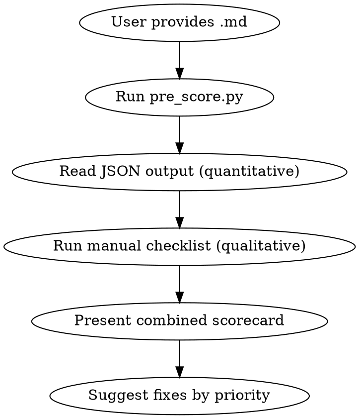
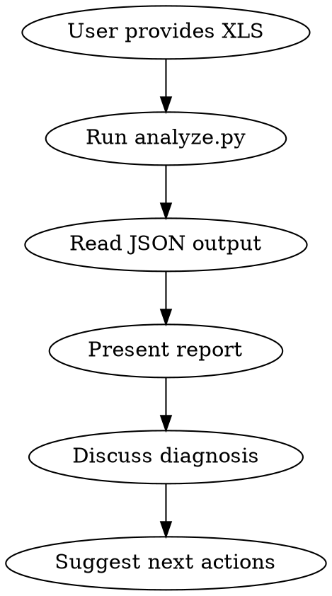

# WeChat Content Analytics

Two modes:
1. **Post-publish**: Parse WeChat backend XLS exports, calculate KPIs, score, diagnose
2. **Pre-publish**: Score a markdown article against controllable metrics before publishing

## When to Use

- User provides WeChat backend exported `.xls` file(s) and wants performance analysis
- User asks to review/diagnose article performance ("这篇表现怎么样", "帮我复盘")
- User wants to compare multiple articles' performance
- **User wants to pre-check an article before publishing** ("帮我检查", "发布前评分")
- NOT for: content creation, topic selection, or general marketing strategy

---

# Mode 1: Pre-publish Scoring

Score a markdown article against controllable metrics before publishing. Benchmarks calibrated from real historical data in `data/articles.csv`.

## Pre-publish Workflow



### Step 1: Run Pre-score Script

```bash
python3 .claude/skills/wechat-content-analytics/scripts/pre_score.py \
  "/path/to/article.md"
```

The script outputs JSON with quantitative metrics:
- Title length, chapter count, total word count, words per chapter
- Bold count, bold density per 1000 chars
- Has brand bridge (detects 心情可可/可可 mention)
- Has share CTA (detects 转发/分享 in last 500 chars)
- 300-word rhythm analysis (turn points and flat zones)

### Step 2: Manual Qualitative Checklist

Score these dimensions manually (each 0-4). Read the article and answer:

#### 2a. 标题力 (Weight: 25%)

| Score | Criteria |
|-------|----------|
| 0 | 无好奇心缺口，读者看标题就觉得不需要点开 |
| 1 | 有信息但缺乏驱动力，"可以看看" |
| 2 | 有好奇心缺口，"想知道答案" |
| 3 | 强驱动力，"不点开会难受" + 身份安全（转发不丢面子）|
| 4 | 标题本身就是社交货币（读者会截图标题转发）|

**校准参考**（来自历史数据）：
- "我们在用 AI 给幸福加外挂。" (14字) → 分享率 3.84%，关注 5.22%
- "连群红包都没了，你的年味还剩什么" (16字) → 分享率 1.33%
- 最佳标题长度：**14-18字**

#### 2b. 开头钩子 (Weight: 20%)

| Score | Criteria |
|-------|----------|
| 0 | 自我介绍/背景铺垫，无驱动力 |
| 1 | 有场景但缺乏悬念 |
| 2 | 前3句建立场景+制造好奇 |
| 3 | 前2句完成情绪反转或认知冲击 |
| 4 | 第1句就让人停不下来 |

**校准参考**：
- 年味篇开头 2 句完成反转 → 完读率 52%，停留 70 秒
- 好的开头 = 克制（≤3句） + 有反转

#### 2c. 身份安全性 (Weight: 20%)

**核心问题：读者转发这篇文章后，在朋友圈显得______？**

| Score | 转发后的社交形象 |
|-------|----------------|
| 0 | 显得焦虑/负面/矫情 → 不敢转 |
| 1 | 中性，不加分也不减分 |
| 2 | 显得有品味/有思考 |
| 3 | 显得消息灵通/有前瞻性/有爱心 |
| 4 | 转发本身就是身份标签（"这就是我"）|

**校准参考**：
- "AI给幸福加外挂" → 转发显得"积极+前沿" → 分享率 3.84%
- "年味还剩什么" → 转发显得"怀旧+伤感" → 分享率 1.33%
- **身份安全性是分享率的最强预测因子**

#### 2d. 品牌一致性 (Weight: 20%)

| Score | Criteria |
|-------|----------|
| 0 | 与账号定位完全无关，读完不知道为什么要关注这个号 |
| 1 | 主题相关但缺乏品牌特色，任何号都能发 |
| 2 | 体现"人+AI"视角，有团队特色 |
| 3 | 自然桥接到心情可可/团队，读者知道关注后能持续获得什么 |
| 4 | 文章本身就是品牌体验（"只有这个号能写出这种东西"）|

**品牌基准规则**：
- ✓ 必须：文章体现"人+AI"视角（不是纯技术，也不是纯鸡汤）
- ✓ 必须：文末有品牌桥接（1-2句，自然引出心情可可或团队）
- ✗ 不必须：每篇都有心理学理论/术语
- ✗ 不必须：每篇都提到产品功能

**校准参考**：
- 文章1 关注转化 5.22%（品牌一致，自然桥接）
- 文章3 关注转化 0.44%（主题与品牌脱节）

#### 2e. 节奏与深度 (Weight: 15%)

| Score | Criteria |
|-------|----------|
| 0 | 全文平铺直叙，无情绪波动 |
| 1 | 有转折但间隔过长（>500字无变化）|
| 2 | 每300字有转折，但缺乏情绪谷底 |
| 3 | 有清晰的"先抑后扬"或"波浪递进"节奏 |
| 4 | 节奏精准，每个转折都服务于全文情绪弧线 |

**校准参考**：
- 年味篇 4章/2850字 → 完读率 52%
- 最佳参数：4-5章，2500-3500字，每章500-700字

### Step 3: Combined Scorecard

Combine quantitative (script) + qualitative (manual) into一张评分卡：

```
## 发布前评分卡

**文章**: [标题]
**日期**: YYYY-MM-DD

### 量化指标（自动）
| 指标 | 值 | 基线 | 状态 |
|------|---|------|------|
| 标题字数 | X | 14-18 | ✓/⚠️/✗ |
| 总字数 | X | 2500-3500 | ✓/⚠️/✗ |
| 章节数 | X | 4-5 | ✓/⚠️/✗ |
| 章均字数 | X | 500-700 | ✓/⚠️/✗ |
| 金句密度 | X/千字 | 1-3 | ✓/⚠️/✗ |
| 品牌桥接 | 有/无 | 有 | ✓/✗ |
| 分享CTA | 有/无 | 有 | ✓/✗ |
| 平直段 | X处 | 0 | ✓/⚠️/✗ |

### 质性评分（人工）
| 维度 | 权重 | 分数(0-4) | 说明 |
|------|------|----------|------|
| 标题力 | 25% | X | ... |
| 开头钩子 | 20% | X | ... |
| 身份安全性 | 20% | X | ... |
| 品牌一致性 | 20% | X | ... |
| 节奏与深度 | 15% | X | ... |

### 加权总分: X.XX / 4.0
**评级**: 卓越(3.5+) / 优秀(2.5-3.5) / 一般(1.5-2.5) / 不足(<1.5)

### 预估表现
| 指标 | 预估 | 基线 |
|------|------|------|
| 分享率 | X% | 3.85% |
| 关注转化 | X% | 1% |

### 优先修改建议
1. [最影响分享率的问题]
2. [最影响完读率的问题]
3. [品牌相关问题]
```

### Performance Prediction Model

Based on 3 articles of historical data (will improve with more data):

**分享率预估**：主要看 身份安全性 + 金句密度
- 身份安全性 3+ 且有金句 → 预估 3-5%
- 身份安全性 2 → 预估 1-3%
- 身份安全性 0-1 → 预估 <1%

**关注转化预估**：主要看 品牌一致性
- 品牌一致性 3+ → 预估 3-6%
- 品牌一致性 2 → 预估 1-3%
- 品牌一致性 0-1 → 预估 <1%

**Note**: 已有 4 篇历史数据，预估仍粗糙。每发布一篇新文章并录入真实数据后，模型会自动校准。

---

# Mode 2: Post-publish Analysis

## Workflow



### Step 0: Load Historical Data

Read `data/articles.csv` to get all previously analyzed articles as baseline.

```
Read .claude/skills/wechat-content-analytics/data/articles.csv
```

CSV columns: publish_date, title, reads, dwell_seconds, completion_rate_pct, follows, shares, watching, likes, bookmarks, comments, delivered, push_reads, share_reads, engagement_rate_pct, share_rate_pct, follow_rate_pct, viral_coefficient_pct, push_open_rate_pct, share_efficiency, channel_*_pct, score_overall, score_rating, score_*, primary_bottleneck, female_pct, age_26_35_pct, region_beijing_pct

### Step 1: Run Analysis Script on New XLS

```bash
python3 .claude/skills/wechat-content-analytics/scripts/analyze.py \
  "/path/to/新文章.xls" \
  --output /tmp/new_article.json
```

After analysis, **append** the new article's data as a new row to `data/articles.csv` (do NOT overwrite existing rows). This keeps the complete history in one readable CSV.

The script:
- Parses the non-standard XLS layout (section-based detection)
- Extracts raw metrics from 数据概况, 阅读转化, 趋势明细, 人口统计
- Calculates all derived KPIs
- Scores each article (0-4 per dimension, weighted total)
- Runs diagnostic decision tree
- Outputs JSON report

### Step 2: Present Report

Read the JSON output and present to user as structured markdown:

1. **Overview Table** — all articles side by side, sorted by publish date
2. **Scorecard** — per-article scores with benchmark comparison
3. **Trend Analysis** — if 2+ articles, show trajectory of key metrics
4. **Diagnosis** — bottlenecks + specific improvement suggestions

### Step 3: Discuss & Advise

Use the diagnosis to have a conversation. Focus on:
- What's working (don't fix what isn't broken)
- The single biggest bottleneck (not all problems at once)
- One concrete action for the next article

## KPI Reference

### Raw Metrics (from XLS)

| Metric | Field | Section |
|--------|-------|---------|
| 阅读 | 阅读(人) | 数据概况 |
| 停留时长 | 平均停留时长(秒) | 数据概况 |
| 完读率 | 完读率 | 数据概况 (may be absent) |
| 关注 | 阅读后关注（人） | 数据概况 |
| 分享 | 分享(人) | 数据概况 |
| 在看 | 在看(人) | 数据概况 |
| 点赞 | 点赞(人) | 数据概况 |
| 收藏 | 收藏(人) | 数据概况 |
| 评论 | 评论（条） | 数据概况 |
| 送达 | 送达人数 | 阅读转化 |
| 推送阅读 | 公众号消息阅读人数 | 阅读转化 |
| 首次分享 | 首次分享人数 | 阅读转化 |
| 总分享 | 总分享人数 | 阅读转化 |
| 分享带来阅读 | 分享产生的阅读人数 | 阅读转化 |

### Derived KPIs

| KPI | Formula | Meaning |
|-----|---------|---------|
| 互动率 | (点赞+在看+收藏+评论)/阅读 | 内容共鸣度 |
| 分享率 | 分享/阅读 | 社交传播意愿 |
| 关注转化率 | 关注/阅读 | 内容与账号定位匹配度 |
| 裂变系数 | 分享带来阅读/总阅读 | 流量来源结构 |
| 推送打开率 | 推送阅读/送达 | 标题吸引力+粉丝粘性 |
| 分享效率 | 分享带来阅读/分享人数 | 读者社交圈质量 |

## Scoring Model

5 dimensions, weighted total (max 4.0):

| Dimension | Weight | Metric | 0 | 1 | 2 | 3 | 4 |
|-----------|--------|--------|---|---|---|---|---|
| 传播力 | 30% | 分享率 | <1% | 1-3% | 3-5% | 5-10% | >10% |
| 互动力 | 25% | 互动率 | <1% | 1-3% | 3-5% | 5-8% | >8% |
| 触达力 | 20% | 推送打开率 | <2% | 2-5% | 5-10% | 10-20% | >20% |
| 深度 | 15% | 完读率 | <20% | 20-35% | 35-50% | 50-65% | >65% |
| 增长力 | 10% | 关注转化率 | <0.5% | 0.5-1% | 1-2% | 2-5% | >5% |

**Rating**: 3.5+ Exceptional / 2.5-3.5 Strong / 1.5-2.5 Average / <1.5 Weak

**Note on cold-start**: With <500 subscribers, 推送打开率 will be artificially high (small denominator). Weight this metric less in interpretation.

## Diagnostic Decision Tree

```
IF 分享率 < 3%:
  → Bottleneck: 传播力不足
  → 内容缺乏社交货币（让分享者显得聪明/有品味/有爱心）
  → Action: 加入可分享的金句、框架、清单

ELIF 互动率 < 3%:
  → Bottleneck: 共鸣不足
  → 读者读完但不觉得"说出了我的心声"
  → Action: 精准命名读者的感受，加强情绪峰值

ELIF 完读率 < 35%:
  → Bottleneck: 内容留不住人
  → 开头钩子弱、中间冗长、或信息密度不均
  → Action: 前3句制造悬念，每300字一个小转折

ELIF 关注转化率 < 1%:
  → Bottleneck: 文章好但与账号定位脱节
  → 读者喜欢这篇但不觉得需要持续关注
  → Action: 文末强化账号价值主张，预告下期内容

ELSE:
  → 表现良好，复制此类内容模式
```

## Industry Benchmarks (2024-2025)

| Metric | Industry Avg | Good | Excellent |
|--------|-------------|------|-----------|
| 推送打开率 | ~0.89% (订阅号) | >2% | >5% |
| 完读率 | ~50% | >50% | >65% |
| 互动率 | ~3% | >5% | >8% |
| 分享率 | ~3.85% | >5% | >10% |
| 关注转化率 | varies | >1% | >3% |
| 每次分享带来阅读 | ~4人 | >10人 | >20人 |

Source: 新榜, 西瓜数据, 36Kr benchmark reports (2024-2025)

## Channel Definitions

| Channel | Meaning |
|---------|---------|
| 公众号消息 | Push notification (subscriber inbox) |
| 聊天会话 | Shared via private/group chat |
| 朋友圈 | Shared to Moments |
| 公众号主页 | Profile page visits |
| 推荐 | Algorithm recommendation feed |
| 搜一搜 | WeChat Search |
| 其他 | Other sources |

## Common Mistakes

- **Comparing articles without time context**: first article has "novelty bonus" from creator's network
- **Treating push open rate at face value during cold start**: <500 subscribers makes this metric unstable
- **Ignoring channel mix**: high reads from 聊天会话+朋友圈 = manual sharing; high reads from 推荐 = algorithm working
- **Focusing on reads over rates**: 1000 reads with 1% share rate is worse than 200 reads with 10% share rate

## 实战教训（持续更新）

### 2026-02-20："140倍"文章 — 高分享但人群全错

**数据**：分享率 6.88%（4篇最高）、停留 90 秒、完读率 58.6%，但女性仅 18%、18-25 岁仅 9%

**教训**：
- 改造方法论（viral-adaptation）有效，但**选题方向决定了吸引谁**
- AI 科技类爆文吸引 26-45 岁男性从业者，不是目标用户
- 分享率高 ≠ 有效获客，必须看**人群匹配度**
- 群聊传播（85%）不触发推荐算法，"在看"才是进入看一看的门票
- **结论**：用同样的改造方法论，但参考文章必须选目标人群（18-24 女性）关心的领域（心理学/情绪/关系类）

### 2026-02-19："140倍"文章 — 爆文没有导流

- 没有加关注引导，没有小程序卡片，白白浪费爆文流量
- **结论**：发布前必须过检查清单，尤其是导流项
