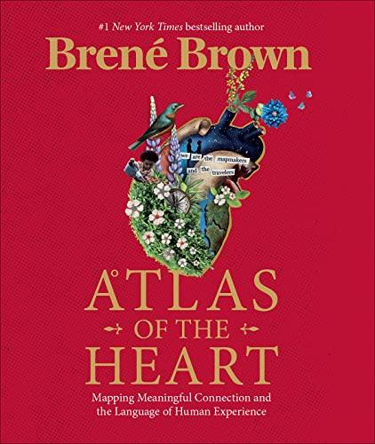

## Your Kindle Notes For:

Atlas of the Heart: Mapping Meaningful Connection and
the Language of Human Experience
by Brené Brown
Free Kindle instant preview: https://a.co/0gAfDo9
247 Highlights
Highlight (Yellow) | Location 373
“socially acceptable” place for processing anger, like driving and sporting events.
Highlight (Yellow) | Location 402
understood that people would do almost anything to not feel pain, including causing pain and abusing power,
and I understood that there were very few people who could handle being held accountable for causing hurt
without rationalizing, blaming, or shutting down.
Highlight (Yellow) | Location 413
being able to see what’s coming doesn’t make it any less painful when it arrives.
Highlight (Yellow) | Location 416
It’s awful that the same substances that take the edge off anxiety and pain also dull our sense of observation. We
see the pain caused by the misuse of power, so we numb our pain and lose track of our own power. We become
terrified of feeling pain, so we engage in behaviors that become a magnet for more pain. We run from anger and
grief straight into the arms of fear, perfectionism, and the desperate need for control.
Highlight (Yellow) | Location 423
When we stop numbing and start feeling and learning again, we have to reevaluate everything, especially how to
choose loving ourselves over making other people comfortable.
Highlight (Yellow) | Location 440
I am responsible for holding you accountable in a respectful and productive way. I’m not responsible for your
emotional reaction to that accountability.
Highlight (Yellow) | Location 449
scaling courage-building skills

---

Highlight (Yellow) | Location 461
“The limits of my language mean the limits of my world.”
Highlight (Yellow) | Location 475
naming an experience doesn’t give the experience more power, it gives us the power of understanding and
meaning.
Highlight (Yellow) | Location 483
Our ability to accurately recognize and label emotions is often referred to as emotional granularity.
Highlight (Yellow) | Location 486
if we don’t have a sufficient emotional vocabulary, it is difficult to communicate our needs and to get the
support that we need from others.
Highlight (Yellow) | Location 492
emotions “signal rewards and dangers.12
Highlight (Yellow) | Location 575
“I am a mapmaker and a traveler.” It’s my way of telling you that I don’t have the answers.
Highlight (Yellow) | Location 589
there are two ways to make a map: actual exploration to collect your own data, and using data provided by other
people.
Highlight (Yellow) | Location 590
Either way, maps are about layers. If you’re using existing data, you might start with elevation, then use a
different set of data to layer on roads, then perhaps use hydrography data to find the lakes, streams, and rivers,
and so on.
Highlight (Yellow) | Location 592
while different maps may use different layers, the one thing that all maps do is provide readers with orientation.
Highlight (Yellow) | Location 599
“Maps are the most important documents in human history. They give us tools to store and exchange knowledge
about space and place.”

---

Highlight (Yellow) | Location 600
We are meaning makers, and a sense of place is central to meaning-making.
Highlight (Yellow) | Location 606
human emotions and experiences are layers of biology, biography, behavior, and backstory.
Highlight (Yellow) | Location 649
We feel stressed when we evaluate environmental demand as beyond our ability to cope successfully.1 This
includes elements of unpredictability, uncontrollability, and feeling overloaded.
Highlight (Yellow) | Location 653
emotional reaction is more tied to our cognitive assessment of whether we can cope with the situation than to
how our body is reacting.
Highlight (Yellow) | Location 664
Overwhelmed means an extreme level of stress, an emotional and/or cognitive intensity to the point of feeling
unable to function.
Highlight (Yellow) | Location 672
Jon Kabat-Zinn describes overwhelm as the all-too-common feeling “that our lives are somehow unfolding
faster than the human nervous system and psyche are able to manage well.”
Highlight (Yellow) | Location 702
That’s what anxiety feels like to me. Escalating loss of control, worst-case-scenario thinking and imagery, and
total uncertainty.
Highlight (Yellow) | Location 732
An intolerance for uncertainty is an important contributing factor to all types of anxiety.16 Those of us who are
generally uncomfortable with uncertainty are more likely to experience anxiety in specific situations as well as
to have trait anxiety and anxiety disorders.
Highlight (Yellow) | Location 735
Our anxiety often leads to one of two coping mechanisms: worry or avoidance.

---

Highlight (Yellow) | Location 737
Worrying and anxiety go together, but worry is not an emotion; it’s the thinking part of anxiety. Worry is
described as a chain of negative thoughts about bad things that might happen in the future.
Highlight (Yellow) | Location 743
Avoidance, the second coping strategy for anxiety, is not showing up and often spending a lot of energy
zigzagging around and away from that thing that already feels like it’s consuming us.
Highlight (Yellow) | Location 748
Avoidance will make you feel less vulnerable in the short run, but it will never make you less afraid.”
Highlight (Yellow) | Location 752
Even though excitement is described as an energized state of enthusiasm leading up to or during an enjoyable
activity, it doesn’t always feel great.
Highlight (Yellow) | Location 758
Dread occurs frequently in response to high-probability negative events; its magnitude increases as the dreaded
event draws nearer.
Highlight (Yellow) | Location 766
Fear is a negative, short-lasting, high-alert emotion in response to a perceived threat, and, like anxiety, it can be
measured as a state or trait.
Highlight (Yellow) | Location 770
The typical responses are fight, flight, or freeze.
Highlight (Yellow) | Location 782
Vulnerability is the emotion that we experience during times of uncertainty, risk, and emotional exposure.
Highlight (Yellow) | Location 795
There is no courage without vulnerability. Courage requires the willingness to lean into uncertainty, risk, and
emotional exposure.

---

Highlight (Yellow) | Location 799
In a world where perfectionism, pleasing, and proving are used as armor to protect our egos and our feelings, it
takes a lot of courage to show up and be all in when we can’t control the outcome.
Highlight (Yellow) | Location 819
Comparison is actually not an emotion, but it drives all sorts of big feelings that can affect our relationships and
our self-worth.
Highlight (Yellow) | Location 831
“cultivating creativity and letting go of comparison.” Comparison is a creativity killer, among other things.
Highlight (Yellow) | Location 833
Comparison is the crush of conformity from one side and competition from the other—it’s trying to
simultaneously fit in and stand out.
Highlight (Yellow) | Location 834
Comparison says, “Be like everyone else, but better.”
Highlight (Yellow) | Location 840
The comparison mandate becomes this crushing paradox of “Fit in and stand out!” It’s not be yourself and
respect others for being authentic, it’s “Fit in, but win.”
Highlight (Yellow) | Location 852
comparing ourselves to others leads us to fear, anger, shame, and sadness.
Highlight (Yellow) | Location 880
We feel admiration when someone’s abilities, accomplishments, or character inspires us, or when we see
something else that inspires us, like art or nature.
Highlight (Yellow) | Location 881
Interestingly, admiration often leads to us wanting to improve ourselves. It doesn’t, however, make us want to be
like the person or thing we admire—we just want to be better versions of ourselves.

---

Highlight (Yellow) | Location 885
Reverence, which is sometimes called adoration, worship, or veneration, is a deeper form of admiration or
respect and is often combined with a sense of meaningful connection with something greater than ourselves.
Highlight (Yellow) | Location 889
What’s interesting is that while admiration fosters self-betterment, reverence seems to foster a desire for
connection to what we revere—we want to move closer to that thing or person.
Highlight (Yellow) | Location 903
Envy occurs when we want something that another person has.
Highlight (Yellow) | Location 904
Jealousy is when we fear losing a relationship or a valued part of a relationship that we already have.
Highlight (Yellow) | Location 925
Jealousy doesn’t seem to be a singular emotion but rather a cognitive evaluation in response to feeling anger,
sadness, and/or fear. In other words, we think jealousy in response to how we feel.
Highlight (Yellow) | Location 966
unwanted identity is the most powerful elicitor of shame.
Highlight (Yellow) | Location 967
It’s really important for me not to be perceived as ________________.
Highlight (Yellow) | Location 1007
Resentment is the feeling of frustration, judgment, anger, “better than,” and/or hidden envy related to perceived
unfairness or injustice. It’s an emotion that we often experience when we fail to set boundaries or ask for what
we need, or when expectations let us down because they were based on things we can’t control, like what other
people think, what they feel, or how they’re going to react.
Highlight (Yellow) | Location 1014
“schadenfreude,” it simply means pleasure or joy derived from someone else’s suffering or misfortune.
Highlight (Yellow) | Location 1033
nothing that celebrates the humiliation or pain of another person builds lasting connection.

---

Highlight (Yellow) | Location 1054
without a viable accountability strategy, it’s hard not to let the shitty emotions take over.
Highlight (Yellow) | Location 1060
freudenfreude, which is the opposite of schadenfreude—it’s the enjoyment of another’s success.
Highlight (Yellow) | Location 1062
“When others report success to us, they generally hope for an empathic response of shared joy (Freudenfreude).
Highlight (Yellow) | Location 1065
Ongoing lack of Freudenfreude eventually can pose a fatal challenge to a relationship,
Highlight (Yellow) | Location 1075
Shoy: intentionally sharing the joy of someone relating a success story by showing interest and asking follow-up
questions.
Highlight (Yellow) | Location 1077
Bragitude: intentionally tying words of gratitude toward the listener following discussion of personal successes.
Highlight (Yellow) | Location 1093
Boredom is the uncomfortable state of wanting to engage in satisfying activity, but being unable to do it.
Highlight (Yellow) | Location 1099
If I assign myself something to do and it’s really boring, I normally end up mindlessly scrolling on social media.
Highlight (Yellow) | Location 1129
Disappointment is unmet expectations. The more significant the expectations, the more significant the
disappointment.
Highlight (Yellow) | Location 1138
The unconscious, unexamined, and unexpressed expectations are the most dangerous and often turn into
disappointment.

---

Highlight (Yellow) | Location 1176
my expectations often come down to fear, a need for certainty, or a need for rest and play.
Highlight (Yellow) | Location 1180
Are you setting goals and expectations that are completely outside of your control?
Highlight (Yellow) | Location 1197
It’s dangerous to put your self-worth in other people’s hands.
Highlight (Yellow) | Location 1228
when disappointment happens, it’s an incredible opportunity for meaningful connection.
Highlight (Yellow) | Location 1269
With regret, we believe the outcome was caused by our decisions or actions.
Highlight (Yellow) | Location 1278
What I regret most in my life are failures of kindness.17 Those moments when another human being was there,
in front of me, suffering, and I responded … sensibly. Reservedly. Mildly.
Highlight (Yellow) | Location 1287
The idea of “no regrets” doesn’t mean living with courage, it means living without reflection.
Highlight (Yellow) | Location 1297
what we regret most are our failures of courage, whether it’s the courage to be kinder, to show up, to say how we
feel, to set boundaries, to be good to ourselves, to say yes to something scary.
Highlight (Yellow) | Location 1305
Disappointed: It didn’t work out how I wanted, and I believe the outcome was outside of my control.
Highlight (Yellow) | Location 1306
Regretful: It didn’t work out how I wanted, and the outcome was caused by my decisions, actions, or failure to
act.

---

Highlight (Yellow) | Location 1307
Discouraged: I’m losing my confidence and enthusiasm about any future effort—I’m losing the motivation and
confidence to persist.
Highlight (Yellow) | Location 1309
Resigned: I’ve lost my confidence and enthusiasm about any future effort—I’ve lost the motivation and
confidence to persist.
Highlight (Yellow) | Location 1311
Frustrated: Something that feels out of my control is preventing me from achieving my desired outcome.
Highlight (Yellow) | Location 1341
“Wonder inspires the wish to understand; awe inspires the wish to let shine, to acknowledge and to unite.”
Highlight (Yellow) | Location 1367
when we’re trying to work through our confusion, we need to stop and think, engage in careful deliberation,
develop a solution, and revise how we approach the next problem.10
Highlight (Yellow) | Location 1373
“To be effective, learning needs to be effortful.
Highlight (Yellow) | Location 1379
too much confusion can lead to frustration, giving up, disengagement, or even boredom.
Highlight (Yellow) | Location 1394
Curiosity seems to be both a trait and a state. You can be a curious person and, regardless of having this trait or
not, you can feel curious about something in the moment. Interest is more of a state (“interested” is not who we
are but how we are at a specific time).
Highlight (Yellow) | Location 1398
Interest is a cognitive openness to engaging with a topic or experience.
Highlight (Yellow) | Location 1399
Curiosity is recognizing a gap in our knowledge about something that interests us, and becoming emotionally
and cognitively invested in closing that gap through exploration and learning. Curiosity often starts with interest
and can range from mild curiosity to passionate investigation.

---

Highlight (Yellow) | Location 1407
curiosity is the feeling of deprivation we experience when we identify and focus on a gap in our knowledge.
Highlight (Yellow) | Location 1430
surprise as an interruption caused by information that doesn’t fit with our current understanding or expectations.
18
Highlight (Yellow) | Location 1434
Surprise is the shortest-duration emotion, rarely lasting more than a few seconds.
Highlight (Yellow) | Location 1434
In addition to being a short bridge, surprise is also an amplifier.
Highlight (Yellow) | Location 1467
the problem of oversimplifying and the importance of complexity:
Highlight (Yellow) | Location 1470
learn to recognize complexity as a signal of credibility.
Highlight (Yellow) | Location 1480
when experts express doubt, they become more persuasive.
Highlight (Yellow) | Location 1496
The definition of amusement that aligns with our research is “pleasurable, relaxed excitation.”4
Highlight (Yellow) | Location 1515
Bittersweet is a mixed feeling of happiness and sadness.
Highlight (Yellow) | Location 1531
What all of the comments have in common is sadness about letting go of something, mixed with happiness and/
or gratitude about what’s been experienced and/or what’s next.

---

Highlight (Yellow) | Location 1562
researchers describe nostalgia as a frequent, primarily positive, context-specific bittersweet emotion that
combines elements of happiness and sadness with a sense of yearning and loss.16
Highlight (Yellow) | Location 1583
rumination, which Garrido explains is an “involuntary focus on negative and pessimistic thoughts.”
Highlight (Yellow) | Location 1593
Exploit fears by photoshopping a picture of yesteryear to be everything people wanted it to be (but never was),
seduce people into believing that a make-believe past could exist again, and give them someone to blame for
ruining the picture and/or not being able to restore the mythical utopia.
Highlight (Yellow) | Location 1599
We define nostalgia as a yearning for the way things used to be in our often idealized and self-protective version
of the past.
Highlight (Yellow) | Location 1629
Cognitive dissonance is a state of tension that occurs when a person holds two cognitions (ideas, attitudes,
beliefs, opinions) that are psychologically inconsistent with each other, such as “Smoking is a dumb thing to do
because it could kill me” and “I smoke two packs a day.”
Highlight (Yellow) | Location 1655
A paradox is the appearance of contradiction between two related components.
Highlight (Yellow) | Location 1666
We’re drawn to authentic, imperfect people, but we’re scared to let people see who we really are.
Highlight (Yellow) | Location 1669
Embracing the paradox teaches us how to think deeper and with more complexity.
Highlight (Yellow) | Location 1692
Irony and sarcasm are forms of communication in which the literal meaning of the words is different, often
opposite, from the intended message.39 In both irony and sarcasm, there may be an element of criticism and
humor. However, sarcasm is a particular type of irony in which the underlying message is normally meant to
ridicule, tease, or criticize.

---

Highlight (Yellow) | Location 1743
Anguish is an almost unbearable and traumatic swirl of shock, incredulity, grief, and powerlessness.
Highlight (Yellow) | Location 1745
Anguish often causes us to physically crumple in on ourselves,
Highlight (Yellow) | Location 1817
Hope is a way of thinking—a cognitive process.
Highlight (Yellow) | Location 1837
hope is learned.
Highlight (Yellow) | Location 1848
Hopelessness arises out of a combination of negative life events and negative thought patterns, particularly self-
blame and the perceived inability to change our circumstances.
Highlight (Yellow) | Location 1859
Despair is a sense of hopelessness about a person’s entire life and future. When extreme hopelessness seeps into
all the corners of our lives and combines with extreme sadness, we feel despair.
Highlight (Yellow) | Location 1918
sadness is important and we need it.
Highlight (Yellow) | Location 1969
“A central process in grieving is the attempt to reaffirm or reconstruct a world of meaning that has been
challenged by loss.”
Highlight (Yellow) | Location 2029
What’s the most effective way to be in connection with and in service to someone who is struggling, without
taking on their issues as our own?
Highlight (Yellow) | Location 2034
I would argue that a lot of this linguistic shell-gaming is about wanting to be contrarian. There’s nothing more
seductive and clickable than a discovery that something we believe to be good is bad:

---

Highlight (Yellow) | Location 2037
If research is going to serve people, it has to reflect their experiences.
Highlight (Yellow) | Location 2046
Compassion is a daily practice and empathy is a skill set that is one of the most powerful tools of compassion.
Highlight (Yellow) | Location 2050
Compassion is the daily practice of recognizing and accepting our shared humanity so that we treat ourselves
and others with loving-kindness, and we take action in the face of suffering.
Highlight (Yellow) | Location 2062
Compassion is not a relationship between the healer and the wounded. It’s a relationship between equals.
Highlight (Yellow) | Location 2074
pity is the near enemy of compassion.
Highlight (Yellow) | Location 2087
There’s nothing worse than feeling pitied, and we have the research to show us why it feels so isolating. Pity
involves four elements: a belief that the suffering person is inferior; a passive, self-focused reaction that does not
include providing help; a desire to maintain emotional distance; and avoidance of sharing in the other person’s
suffering.
Highlight (Yellow) | Location 2096
Empathy, the most powerful tool of compassion, is an emotional skill set that allows us to understand what
someone is experiencing and to reflect back that understanding.
Highlight (Yellow) | Location 2108
meaningful connection requires a combination of compassion and cognitive empathy or perspective taking.
Highlight (Yellow) | Location 2110
the empathy I’m talking about is understanding what someone is feeling, not feeling it for them.
Highlight (Yellow) | Location 2136
we can definitely consider sympathy the near enemy of empathy.

---

Highlight (Yellow) | Location 2136
Rather than being a tool for connection, sympathy emerged in the data as a form of disconnection.
Highlight (Yellow) | Location 2140
Researchers found that cancer patients on the receiving end of sympathy describe it as an unwanted, superficial,
pity-based response that, although well intended, is focused on the observer’s discomfort rather than on
alleviating the patient’s distress.
Highlight (Yellow) | Location 2209
Boundaries are a prerequisite for compassion and empathy. We can’t connect with someone unless we’re clear
about where we end and they begin. If there’s no autonomy between people, then there’s no compassion or
empathy, just enmeshment.
Highlight (Yellow) | Location 2217
if we really want to practice compassion, we have to start by setting boundaries and holding people accountable
for their behavior.”
Highlight (Yellow) | Location 2220
when I’m prioritizing being liked over being free, I was much sweeter but less authentic.
Highlight (Yellow) | Location 2232
Clear is kind. Unclear is unkind.
Highlight (Yellow) | Location 2235
It’s okay to be pissed. It’s not okay to raise your voice and pound on the table.
Highlight (Yellow) | Location 2256
“Science is not the truth.1 Science is finding the truth. When science changes its opinion, it didn’t lie to you. It
learned more.”
Highlight (Yellow) | Location 2266
perfectionism is a function of shame.

---

Highlight (Yellow) | Location 2267
Shame— I am bad. The focus is on self, not behavior. The result is feeling flawed and unworthy of love,
belonging, and connection. Shame is not a driver of positive change.
Highlight (Yellow) | Location 2270
Guilt— I did something bad. The focus is on behavior. Guilt is the discomfort we feel when we evaluate what
we’ve done or failed to do against our values. It can drive positive change and behavior.
Highlight (Yellow) | Location 2273
Humiliation— I’ve been belittled and put down by someone. This left me feeling unworthy of connection and
disgusted with myself. This was unfair and I didn’t deserve this. With shame, we believe that we deserve our
sense of unworthiness. With humiliation, we don’t feel we deserve it.
Highlight (Yellow) | Location 2277
Embarrassment— I did something that made me uncomfortable, but I know I’m not alone. Everyone does these
kinds of things. Embarrassment is fleeting, sometimes funny.
Highlight (Yellow) | Location 2308
Shame is the fear of disconnection—it’s the fear that something we’ve done or failed to do, an ideal that we’ve
not lived up to, or a goal that we’ve not accomplished makes us unworthy of connection. I’m unlovable. I don’t
belong.
Highlight (Yellow) | Location 2311
Shame is the intensely painful feeling or experience of believing that we are flawed and therefore unworthy of
love, belonging, and connection.
Highlight (Yellow) | Location 2314
The antidote to shame is empathy. If we reach out and share our shame experience with someone who responds
with empathy, shame dissipates.
Highlight (Yellow) | Location 2317
Shame is a social emotion.
Highlight (Yellow) | Location 2356
narcissism as the shame-based fear of being ordinary.

---

Highlight (Yellow) | Location 2378
Perfectionism is not striving to be our best or working toward excellence. Healthy striving is internally driven.
Perfectionism is externally driven by a simple but potentially all-consuming question: What will people think?
Highlight (Yellow) | Location 2380
one of the biggest barriers to working toward mastery is perfectionism.
Highlight (Yellow) | Location 2399
perfectionism is a self-destructive and addictive belief system that fuels this primary thought: If I look perfect,
live perfectly, work perfectly, and do everything perfectly, I can avoid or minimize the painful feelings of
shame, judgment, and blame.
Highlight (Yellow) | Location 2426
Like shame, guilt is an emotion that we experience when we fall short of our own expectations or standards.
However, with guilt, our focus is on having done something wrong and on doing something to set things right,
like apologizing or changing a behavior.
Highlight (Yellow) | Location 2442
humiliation as the intensely painful feeling that we’ve been unjustly degraded, ridiculed, or put down and that
our identity has been demeaned or devalued.
Highlight (Yellow) | Location 2477
“Never allow anyone to be humiliated in your presence.”
Highlight (Yellow) | Location 2479
Embarrassment is a fleeting feeling of self-conscious discomfort in response to a minor incident that was
witnessed by others.
Highlight (Yellow) | Location 2509
We have to belong to ourselves as much as we need to belong to others. Any belonging that asks us to betray
ourselves is not true belonging.
Highlight (Yellow) | Location 2545
True belonging doesn’t require us to change who we are; it requires us to be who we are.

---

Highlight (Yellow) | Location 2554
our sense of belonging can never be greater than our level of self-acceptance.
Highlight (Yellow) | Location 2675
I define connection as the energy that exists between people when they feel seen, heard, and valued; when they
can give and receive without judgment; and when they derive sustenance and strength from the relationship.
Highlight (Yellow) | Location 2696
Disconnection is often equated with social rejection, social exclusion, and/or social isolation, and these feelings
of disconnection actually share the same neural pathways with feelings of physical pain.
Highlight (Yellow) | Location 2736
self-security, which they define as “the open and nonjudgmental acceptance of one’s own weaknesses.”
Highlight (Yellow) | Location 2743
people who are more secure are more willing to be vulnerable with others.
Highlight (Yellow) | Location 2754
invisibility as a function of disconnection and dehumanization, where an individual or group’s humanity and
relevance are unacknowledged, ignored, and/or diminished in value or importance.
Highlight (Yellow) | Location 2773
two types of dehumanization—stereotyping and invisibility.
Highlight (Yellow) | Location 2790
At the heart of loneliness is the absence of meaningful social interaction—an intimate relationship, friendships,
family gatherings, or even community or work group connections.
Highlight (Yellow) | Location 2798
“To grow into an adulthood for a social species, including humans, is not to become autonomous and solitary,
it’s to become the one on whom others can depend. Whether we know it or not, our brain and biology have been
shaped to favor this outcome.”
Highlight (Yellow) | Location 2819
it’s not the quantity of friends but the quality of a few relationships that actually matters.

---

Highlight (Yellow) | Location 2847
the umbrella term love as including “the preoccupying and strong desire for further connection, the powerful
bonds people hold with a select few and the intimacy that grows between them, the commitments to loyalty and
faithfulness.”
Highlight (Yellow) | Location 2874
We cultivate love when we allow our most vulnerable and powerful selves to be deeply seen and known, and
when we honor the spiritual connection that grows from that offering with trust, respect, kindness, and affection.
Highlight (Yellow) | Location 2877
Love is not something we give or get; it is something that we nurture and grow, a connection that can be
cultivated between two people only when it exists within each one of them—we can love others only as much as
we love ourselves.
Highlight (Yellow) | Location 2879
Shame, blame, disrespect, betrayal, and the withholding of affection damage the roots from which love grows.
Love can survive these injuries only if they’re acknowledged, healed, and rare.
Highlight (Yellow) | Location 2908
Heartbreak is what happens when love is lost.
Highlight (Yellow) | Location 2941
trust as “choosing to risk making something you value vulnerable to another person’s actions.”
Highlight (Yellow) | Location 2943
distrust as a general assessment that “what is important to me is not safe with this person in this situation (or any
situation).”
Highlight (Yellow) | Location 2977
For there to be betrayal, there would have to have been trust first.12
Highlight (Yellow) | Location 2980
Betrayal is so painful because, at its core, it is a violation of trust.13 It happens in relationships in which trust is
expected and assumed, so when it’s violated, we’re often shocked, and we can struggle to believe what’s
happening. It can feel as if the ground beneath us has given way.

---

Highlight (Yellow) | Location 3016
At its core, defensiveness is a way to protect our ego and a fragile self-esteem.
Highlight (Yellow) | Location 3019
With grounded confidence, we accept our imperfections and they don’t diminish our self-worth.
Highlight (Yellow) | Location 3022
In order to try to limit our exposure to information that differs from how we think of ourselves, we get defensive
and overjustify, make excuses, minimize, blame, discredit, discount, refute, and reinterpret.
Highlight (Yellow) | Location 3033
When I get defensive, I often get tunnel vision and start planning what I’m going to say instead of listening.
Highlight (Yellow) | Location 3035
“I’m sorry. Can you say that again? I really want to understand.”
Highlight (Yellow) | Location 3040
flooding is “a sensation of feeling psychologically and physically overwhelmed during conflict, making it
virtually impossible to have a productive, problem-solving discussion.”
Highlight (Yellow) | Location 3065
“My feelings are hurt.” It’s simple, vulnerable, and honest. But we don’t say it very often.
Highlight (Yellow) | Location 3093
when we respond to hurt feelings with anger, the other person tends to match our anger with more anger.
Highlight (Yellow) | Location 3134
Joy is sudden, unexpected, short-lasting, and high-intensity.6 It’s characterized by a connection with others, or
with God, nature, or the universe. Joy expands our thinking and attention, and it fills us with a sense of freedom
and abandon.
Highlight (Yellow) | Location 3137
Happiness is stable, longer-lasting, and normally the result of effort.7 It’s lower in intensity than joy, and more
self-focused. With happiness, we feel a sense of being in control. Unlike joy, which is more internal, happiness
seems more external and circumstantial.

---

Highlight (Yellow) | Location 3150
joy as an intense feeling of deep spiritual connection, pleasure, and appreciation.
Highlight (Yellow) | Location 3160
Researchers describe the relationship between joy and gratitude as an “intriguing upward spiral.”
Highlight (Yellow) | Location 3189
the state of happiness as feeling pleasure often related to the immediate environment or current circumstances.
Highlight (Yellow) | Location 3194
calm as creating perspective and mindfulness while managing emotional reactivity.
Highlight (Yellow) | Location 3195
people who can bring perspective to complicated situations and experience their feelings without reacting to
heightened emotions.
Highlight (Yellow) | Location 3203
Calm is an intention. Do we want to infect people with more anxiety, or heal ourselves and the people around us
with calm?
Highlight (Yellow) | Location 3210
Do I have enough information to freak out? The answer is normally no.
Highlight (Yellow) | Location 3211
Will freaking out help? The answer is always no.
Highlight (Yellow) | Location 3213
When you are discontent, you always want more, more, more.21
Highlight (Yellow) | Location 3221
I define contentment as the feeling of completeness, appreciation, and “enoughness” that we experience when
our needs are satisfied.

---

Highlight (Yellow) | Location 3253
Research on emotion shows that positive emotions wear off quickly.27 Our emotional systems like newness.
They like novelty. They like change. We adapt to positive life circumstances so that before too long, the new
car, the new spouse, the new house—they don’t feel so new and exciting anymore. But gratitude makes us
appreciate the value of something, and when we appreciate the value of something, we extract more benefits
from it; we’re less likely to take it for granted. In effect, I think gratitude allows us to participate more in life.
We notice the positives more, and that magnifies the pleasures you get from life. Instead of adapting to
goodness, we celebrate goodness. We spend so much time watching things—movies, computer screens, sports—
but with gratitude we become greater participants in our lives as opposed to spectators.
Highlight (Yellow) | Location 3271
Gratitude is an emotion that reflects our deep appreciation for what we value, what brings meaning to our lives,
and what makes us feel connected to ourselves and others.
Highlight (Yellow) | Location 3275
An attitude is a way of thinking; a practice is a way of doing, trying, failing, and trying again.
Highlight (Yellow) | Location 3287
If you’re afraid to lean into good news, wonderful moments, and joy—if you find yourself waiting for the other
shoe to drop—you are not alone. It’s called “foreboding joy,” and most of us experience it.
Highlight (Yellow) | Location 3292
emotion is more frightening than joy, because we believe if we allow ourselves to feel joy, we are inviting
disaster.
Highlight (Yellow) | Location 3295
When we push away joy, we squander the goodness that we need to build resilience, strength, and courage.
Highlight (Yellow) | Location 3300
relief as “feelings of tension leaving the body and being able to breathe more easily, thoughts of the worst being
over and being safe for the moment, resting, and wanting to get on to something else.”28
Highlight (Yellow) | Location 3317
Tranquility is associated with the absence of demand” and “no pressure to do anything.”

---

Highlight (Yellow) | Location 3333
anger is an emotion that we feel when something gets in the way of a desired outcome or when we believe
there’s a violation of the way things should be.1 When we feel anger, we believe that someone or something else
is to blame for an unfair or unjust situation, and that something can be done to resolve the problem.
Highlight (Yellow) | Location 3386
anger is often the most compassionate response to experiencing or witnessing injustice.
Highlight (Yellow) | Location 3392
When we deny ourselves the right to be angry, we deny our pain.
Highlight (Yellow) | Location 3411
Anger often masks emotions that are more difficult to name and/or more difficult to own.
Highlight (Yellow) | Location 3412
Just as an indicator light in our car tells us to pull over and check things out, anger is a very effective emotional
indicator light that tells us to pull over and check things out.
Highlight (Yellow) | Location 3413
Anger, in response to experiencing or witnessing injustice, pain, and struggle, can be a powerful catalyst for
change.
Highlight (Yellow) | Location 3414
But, by definition, a catalyst sparks change, it’s not the change.
Highlight (Yellow) | Location 3416
When someone is angry at you, you’ve still got traction with them, but when they display contempt, you’ve been
dismissed.
Highlight (Yellow) | Location 3424
contempt as “perhaps the most corrosive force in marriage,”
Highlight (Yellow) | Location 3467
contempt is poisonous to a relationship because it conveys disgust and superiority, especially moral, ethical, or
characterological.

---

Highlight (Yellow) | Location 3468
Contempt, simply put, says, “I’m better than you. And you are lesser than me.”
Highlight (Yellow) | Location 3481
“motive attribution asymmetry”—the assumption that your ideology is based in love, while your opponent’s is
based in hate
Highlight (Yellow) | Location 3484
Each side thinks it is driven by benevolence, while the other is evil and motivated by hatred—and is therefore an
enemy with whom one cannot negotiate or compromise.
Highlight (Yellow) | Location 3493
solution is not that we need to disagree less, but we need to learn how to disagree better
Highlight (Yellow) | Location 3514
With contempt, we look down on the other person and we want to exclude or ignore them. With disgust,
inferiority is not the issue, the feeling is more physical—we want to avoid being “poisoned” (either literally or
figuratively).
Highlight (Yellow) | Location 3520
disgust “arises as a feeling of aversion towards something offensive.
Highlight (Yellow) | Location 3531
core disgust is thought to protect the body from ingestion of contaminants, while disgust in an interpersonal
context is thought to “protect” us from unseemly behavior or contamination of the soul.31,
Highlight (Yellow) | Location 3536
this is the dangerous relationship between disgust and dehumanization.
Highlight (Yellow) | Location 3543
“moral disgust is even more dangerous because of its dehumanizing implications.
Highlight (Yellow) | Location 3552
once a target is viewed with disgust, this judgment seems to be permanent;

---

Highlight (Yellow) | Location 3566
dehumanization as “the psychological process of demonizing the enemy, making them seem less than human
and hence not worthy of humane treatment.”
Highlight (Yellow) | Location 3602
hate is a combination of various negative emotions including repulsion, disgust, anger, fear, and contempt.43
We feel hate toward individuals or groups that we believe are intentionally malicious and unlikely to change.44
What’s interesting is that we can develop hate toward people we do not know personally simply based on their
affiliation with a group or ideology that doesn’t align with our beliefs.
Highlight (Yellow) | Location 3610
hate is actually fueled by our need for connection. I call this common enemy intimacy.
Highlight (Yellow) | Location 3649
“Self-righteousness is the conviction that one’s beliefs and behaviors are the most correct.”
Highlight (Yellow) | Location 3675
Pride is a feeling of pleasure or celebration related to our accomplishments or efforts.
Highlight (Yellow) | Location 3676
Hubris is an inflated sense of one’s own innate abilities that is tied more to the need for dominance than to actual
accomplishments.
Highlight (Yellow) | Location 3678
Humility is openness to new learning combined with a balanced and accurate assessment of our contributions,
including our strengths, imperfections, and opportunities for growth.
Highlight (Yellow) | Location 3683
authentic pride.
Highlight (Yellow) | Location 3709
dominance “does not require respect or social acceptance.”
Highlight (Yellow) | Location 3718
narcissism as the shame-based fear of being ordinary.

---

Highlight (Yellow) | Location 3726
Hubris sounds like an almost foolproof way to assert yourself in the world—no accomplishments, no respect, no
social acceptance needed. You would, however, have to hone your bullying skills and be open to being seen as
an asshole.
Highlight (Yellow) | Location 3781
Kerlinger defines theory as: “A set of interrelated constructs (concepts), definitions, and propositions that
present a systematic view of phenomena specifying relations among variables, with the purpose of explaining
and predicting the phenomena.”
Highlight (Yellow) | Location 3807
“Near enemies are states that appear similar to the desired quality but actually undermine it.4 Far enemies are
the opposite of what we are trying to achieve.
Highlight (Yellow) | Location 3817
“The near enemies depict how spirituality can be misunderstood or misused to separate us from life.”
Highlight (Yellow) | Location 3818
I define spirituality as the deeply held belief that we are inextricably connected to each other by something
greater than ourselves.
Highlight (Yellow) | Location 3824
On the surface, the near enemies of emotions or experiences might look and even feel like connection, but
ultimately they drive us to be disconnected from ourselves and from each other. Without awareness, near
enemies become the practices that fuel separation, rather than practices that reinforce the inextricable connection
of all people.
Highlight (Yellow) | Location 3852
it’s not fear that gets in the way of courage, it’s armor—how we self-protect when we feel uncertain or fearful.
Highlight (Yellow) | Location 3937
“Trauma victims cannot recover until they become familiar with and befriend the sensations in their bodies.
Highlight (Yellow) | Location 3960
When we are disembodied or disconnected from our own feelings and sensations, it’s easy to become habituated
to practices that we don’t believe in or value.”

---

Highlight (Yellow) | Location 3964
The second major category is practicing the courage to walk alongside.
Highlight (Yellow) | Location 3972
The work is a commitment to be with people—not pushing them from behind or leading from the front, but
walking with them in solidarity.
Highlight (Yellow) | Location 3982
“Help is the sunny side of control.
Highlight (Yellow) | Location 3994
King defined power as the ability to achieve purpose and effect change.
Highlight (Yellow) | Location 4008
Walking away, the far enemy of walking alongside, includes both discounting and dominating behaviors such as
ignoring, dismissing, power over, and building walls (literally and figurately).
Highlight (Yellow) | Location 4021
So how do we know what other people are feeling? We ask them.
Highlight (Yellow) | Location 4023
Story stewardship means honoring the sacred nature of story—the ones we share and the ones we hear—and
knowing that we’ve been entrusted with something valuable or that we have something valuable that we should
treat with respect and care.
Highlight (Yellow) | Location 4025
We are good stewards of the stories we tell by trusting them to people who have earned the right to hear them,
and telling them only when we are ready. We are good stewards of the stories we hear by listening, being
curious, affirming, and believing people when they tell us how they experienced something.
Highlight (Yellow) | Location 4133
Our connection with others can only be as deep as our connection with ourselves.
Highlight (Yellow) | Location 4136
importance to spending time and energy connecting to myself.

---

Highlight (Yellow) | Location 4144
Even when we have no idea where we are or where we’re going, with the right map, we can find our way back
to our heart and to our truest self.

---

