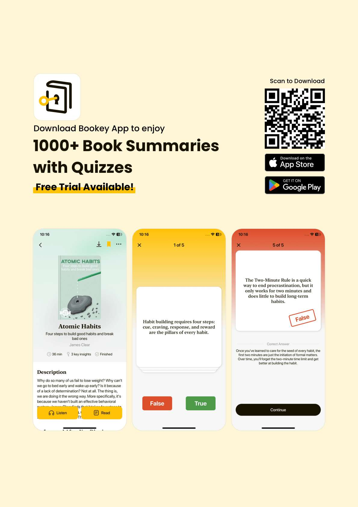
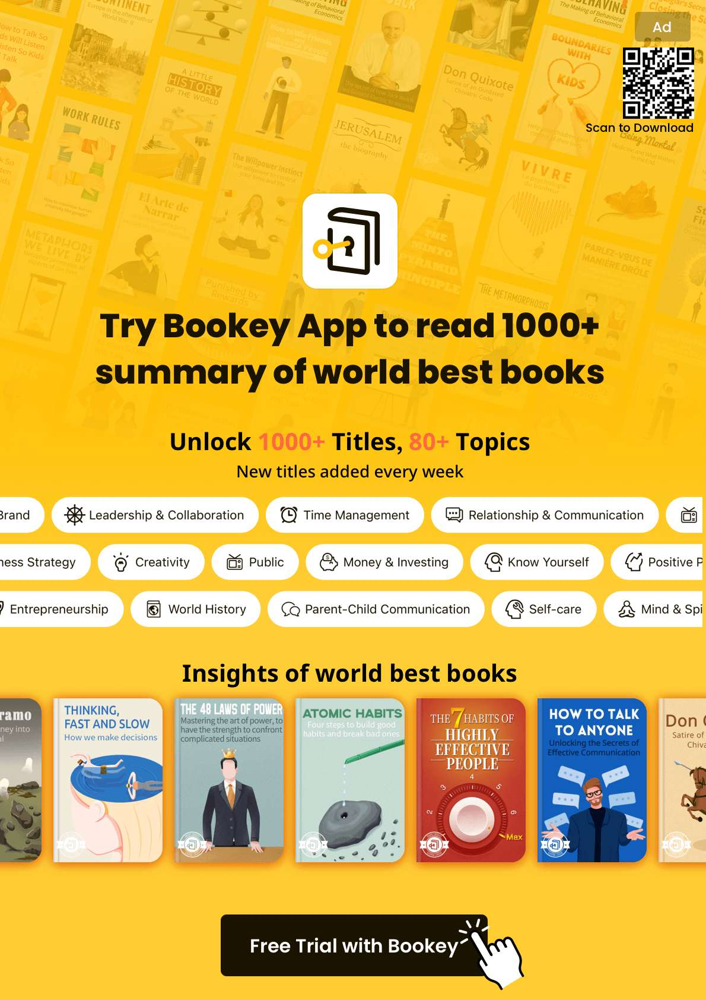
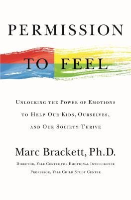
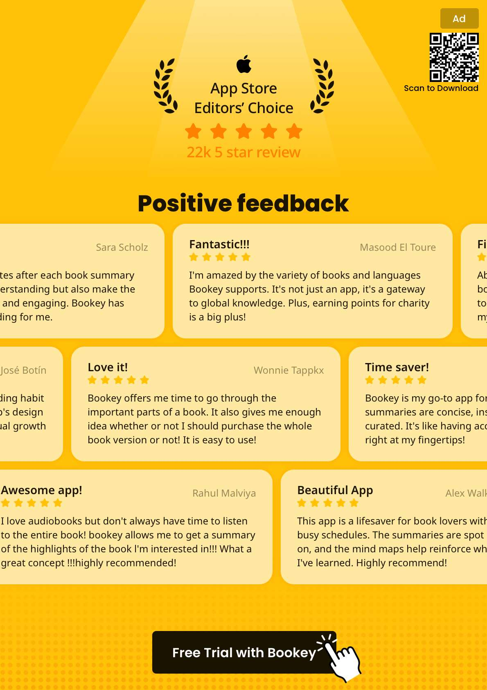
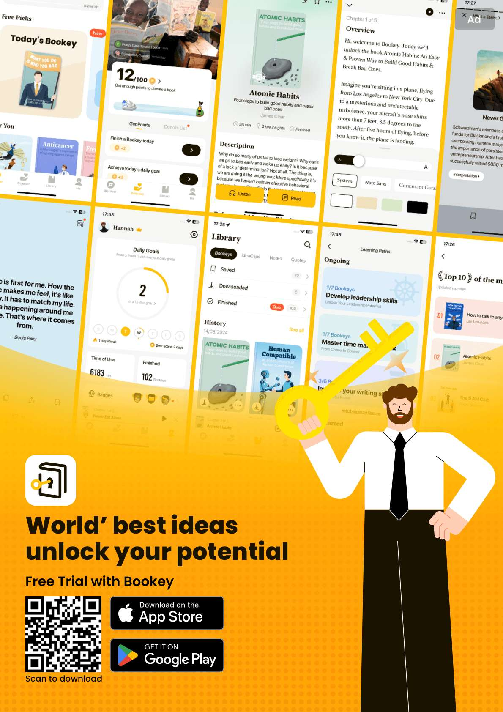

Permission to Feel PDF
Marc Brackett

---

Permission to Feel
Empowering Emotions: A Path to Mental
Well-Being for All
Written by Bookey
Check more about Permission to Feel Summary
Listen Permission to Feel Audiobook

---

About the book
In "Permission to Feel," Marc Brackett, a leading emotion
scientist and professor at Yale University, unveils a
transformative blueprint for enhancing emotional well-being
in both children and adults. Recognizing the alarming decline
in mental health, Brackett draws from his own experiences of
suffering and resilience, instilled through a supportive family
member. His innovative RULER program empowers
individuals to understand and manage their emotions
effectively, fostering a healthier emotional landscape in
schools and homes alike. With a blend of scientific research
and heartfelt inspiration, this book offers practical strategies to
combat emotional distress and cultivate emotional
intelligence, proving that everyone can learn to embrace their
feelings and thrive.

---

About the author
Marc Brackett is a renowned psychologist, educator, and
researcher best known for his work in the field of emotional
intelligence and its impact on learning and well-being. As the
founding director of the Yale Center for Emotional
Intelligence, he has dedicated his career to developing
strategies and tools that help individuals understand, express,
and regulate their emotions effectively. Brackett's innovative
approach emphasizes the importance of emotional awareness
in educational settings and beyond, aiming to foster
environments where individuals can thrive emotionally and
academically. His contributions to the field are encapsulated in
his influential book, "Permission to Feel," where he advocates
for the vital role emotions play in our lives and how embracing
them can lead to improved mental health and fulfillment.

---

Summary Content List

# Chapter 1 : 1. Permission to Feel

# Chapter 2 : 2. Emotions Are Information

# Chapter 3 : 3. How to Become an Emotion Scientist

# Chapter 4 : 4. R: Recognizing Emotion

# Chapter 5 : 5. U: Understanding Emotion

# Chapter 6 : 6. L: Labeling Emotion

# Chapter 7 : 7. E: Expressing Emotion

# Chapter 8 : 8. R: Regulating Emotion

# Chapter 9 : 9. Emotions at Home

# Chapter 10 : 10. Emotions at School: From Preschool to

College

# Chapter 11 : 11. Emotions at Work

---

# Chapter 1 Summary : 1. Permission to

Feel
Permission to Feel
How Are You Feeling?
The question of how we feel is often asked, yet it remains
challenging to answer honestly. The author shares his
personal experiences as a child who struggled with emotional
turmoil, feeling scared, angry, and isolated due to bullying
and familial issues. Despite his parents' love, they were
unaware of his emotional struggles, resulting in a household
where feelings were suppressed.

---

Childhood Challenges
The author's difficulties were compounded by a lack of
communication within the family, leading him to bury his
feelings. This emotional suppression was further exacerbated
by trauma from being sexually abused by a neighbor. When
his abuse was revealed, rather than receiving support, he
became ostracized by peers and faced heightened bullying.
Parental Dynamics
His parents, overwhelmed by their own challenges and not
equipped to manage their son's emotional crises, sent him to
a therapist but failed to recognize the signs of his distress.
The author reflects on how a different approach,
characterized by open communication and emotional literacy,
could have changed his childhood experience.
Common Experiences of Emotional Neglect
Many individuals face similar emotional neglect, regardless
of whether their situations were dramatic or subtle. The
effects are often the same, manifesting as feelings of

---

invisibility and emotional numbness. The author emphasizes
the importance of acknowledging and addressing feelings,
sharing that he entered a survival mode where his emotions
were locked down.
Turning Point: Uncle Marvin
The narrative shifts to a positive influence in the author's life:
Uncle Marvin. Described as a unique and uplifting presence,
Marvin served as a catalyst for change, offering emotional
support and connection that transformed the author’s
outlook. This relationship highlights the importance of
having an ally who understands and values emotional
expression.
Overall, the chapter sets the stage for a deeper exploration of
emotional awareness and the need for permission to feel,
inviting readers to reflect on their emotional experiences and
the importance of understanding feelings in childhood and
beyond.

---

Example
Key Point:Acknowledge Your Feelings
Example:One major takeaway from this chapter is
recognizing the importance of openly acknowledging
and expressing feelings.

---

# Chapter 2 Summary : 2. Emotions Are

Information
Section Summary
Introduction to Emotions are complex, constant forces that influence daily feelings from waking to sleeping, with
Emotions individuals experiencing a wide range of rapidly shifting emotions.
Children and Children experience intense emotions and often lack the coping skills to manage them, which can
Emotional hinder their ability to focus in settings like classrooms.
Experiences
The Importance of Emotions provide vital information about internal states, arising from sensory responses and processed
Emotions by the brain, emphasizing the need to acknowledge them rather than dismiss them.
The Historical Historically, emotions were viewed as barriers to logic, a perspective reinforced by philosophers and
Perception of psychologists who prioritized rational thought over emotional insight.
Emotions
The Emergence of Peter Salovey and John Mayer introduced emotional intelligence in 1990, defining it as the ability to
Emotional understand and manage one's own and others' emotions, highlighting its role in guiding thought and
Intelligence action.
Scientific The concept is grounded in three inquiries: Darwin's view on emotions for survival, the impact of
Foundations of emotions on cognition and decision-making, and the acknowledgment of multiple intelligences,
Emotional including emotional awareness.
Intelligence
Conclusion Emotional intelligence is crucial for reasoning, problem-solving, and social interactions, showcasing
the importance of emotional experiences in life's navigation.
Emotions Are Information

---

Introduction to Emotions
Emotions are complex and constant, influencing our feelings
throughout the day—from the moment we wake up until we
fall asleep. Each individual experiences a myriad of
emotions, which can shift rapidly due to various stimuli.
Children and Emotional Experiences
Children experience heightened emotional intensity and lack
the skills to manage these feelings effectively. Their
emotional experiences can be more pronounced due to their
less developed coping mechanisms, making it challenging for
them to focus in environments like classrooms.
The Importance of Emotions
Emotions provide essential information about our internal
states. They arise from responses to various sensory inputs
and are processed by our brains to help formulate
experiences. It is crucial to acknowledge and understand
these emotions rather than dismiss them as mere

---

disturbances.
The Historical Perception of Emotions
Traditionally, emotions were seen as hindrances to logical
reasoning and cognitive abilities. This view has deep
historical roots, being perpetuated by philosophers and
psychologists who favored rational thought over emotional
understanding.
The Emergence of Emotional Intelligence
In 1990, Peter Salovey and John Mayer introduced the
concept of emotional intelligence, which is defined as the
capacity to understand and manage one's own and others'
emotions. They highlighted the importance of emotions in
guiding thought and action.
Scientific Foundations of Emotional Intelligence
Three main scientific inquiries laid the groundwork for
understanding emotional intelligence:
1.
Darwin's View of Emotion

---

: Emotions provide critical information for survival.
2.
Emotions and Cognition
: Studies reveal that emotions significantly impact thought
processes and decision-making, creating loops where moods
influence judgments and memories.
3.
Multiple Intelligences
: The recognition of diverse cognitive abilities beyond
traditional IQ, including intrapersonal and interpersonal
skills, emphasizes the importance of emotional awareness
and interpersonal relationships.
Conclusion
Emotional intelligence plays a crucial role in reasoning,
problem-solving, and overall human interaction,
underscoring the significance of our emotional experiences in
navigating life.

---

Critical Thinking
Key Point:Emotional Intelligence's Role in Human
Interaction
Critical Interpretation:The key point emphasized in this
chapter is that emotions are informative and integral to
human interaction and cognitive processes. Brackett
argues that understanding and managing emotions can
significantly enhance reasoning, decision-making, and
interpersonal relationships. However, while the
significance of emotional intelligence is widely
recognized, it is essential to critique the assumption that
emotional awareness automatically leads to better
outcomes. For instance, research by social psychologists
such as Sunita P. Sarawagi suggests that the influence of
emotions on cognition can also lead to biases that
impair judgment (Sarawagi, 2020). Therefore, readers
should consider that elevating emotions above
rationality, as Brackett implies, may not universally
apply and could lead to complexities in reasoning.

---

# Chapter 3 Summary : 3. How to Become

an Emotion Scientist
3 How to Become an Emotion Scientist
Introduction to Emotional Awareness
Understanding and identifying our emotions can be more
complex than it seems. Despite believing we know how we
feel, our emotions can be intricate and multifaceted.
Acknowledging this complexity is vital for emotional
intelligence and managing our emotional responses
effectively.
The Importance of Emotion Skills
Emotion skills contribute to successful navigation of
personal and social interactions. Without these skills,
individuals, regardless of cognitive abilities, struggle with
emotional management, which can limit their potential and
affect various life outcomes including relationships,

---

decision-making, and performance.
Integral vs. Incidental Emotions
Emotions can be categorized into integral emotions, directly
linked to the situation at hand, and incidental emotions,
which stem from previous experiences and influence current
circumstances without recognition. Being aware of both
types is fundamental to becoming an emotion scientist.
Understanding and Regulating Emotions
Acquiring emotion skills enables individuals to recognize
and interpret emotions and respond constructively.
Recognizing physical symptoms of strong emotions helps
identify underlying feelings, promoting better emotional
regulation. The process involves not suppressing emotions
but learning to manage them effectively.
Defining Emotional Intelligence
Install Bookey App to Unlock Full Text and
Emotional intelligence is defined by the capacity to perceive,
Audio
appraise, express emotions, and regulate them for personal
growth. While all individuals possess some level of

---

# Chapter 4 Summary : 4. R: Recognizing

Emotion
4 R: Recognizing Emotion
Understanding Your Emotions
The key question to ask is: How are you feeling? It's
essential to pause and sense your emotional state without
overthinking. Take a deep breath and tune into how you feel
in this moment, identifying whether you're energized,
stressed, or balanced.
The Importance of Recognition
Recognition is the first skill in the RULER framework and
involves accurately identifying emotions in ourselves and
others. Many people struggle with this due to not being
taught an emotional vocabulary, feeling unsafe to share
emotions, or societal pressures. Recognizing our emotions is
crucial for learning to regulate them.

---

Recognizing Emotions in Others
Understanding others' emotions is more complex since we
cannot ask them directly. We rely on nonverbal cues such as
body language and facial expressions, as much of our
communication is nonverbal. Not recognizing emotional cues
can lead to misunderstandings and missed opportunities for
support.
The Consequences of Ignoring Emotions
Failing to recognize emotions can result in unnoticed distress
in others, which can further lead to severe consequences like
anxiety or depression. Even in loving environments, one can
feel unseen, making recognition even more vital.
Breaking Through Negative Behaviors
People sometimes exhibit behaviors that deflect attention
from their emotional needs. It is crucial to engage with
others, particularly when their actions suggest they need
help, even if they seem to send the opposite message.

---

Mood Meter Tool
The Mood Meter is based on the circumplex model of
emotion developed by James Russell, which categorizes
emotions using two dimensions: energy and pleasantness.
This tool helps individuals identify their emotions by placing
them on a graph that ranges from unpleasant to pleasant and
from low to high energy levels, aiding in emotional
recognition even when one is unaware of their feelings.

---

Example
Key Point:Recognizing emotions is fundamental to
emotional intelligence and personal well-being.
Example:Imagine sitting quietly during a hectic day,
feeling overwhelmed yet not knowing why. Instead of
ignoring that nagging sensation in your chest, you take a
deep breath and ask yourself: 'How am I feeling?' You
realize that beneath the surface of your stress, there lies
a sense of fatigue. By acknowledging this fatigue, you
open up the possibility to address it, perhaps deciding to
take a break or adjust your workload. This simple
practice of paused reflection enhances your emotional
intelligence and sets the stage for better self-regulation
and understanding of others' feelings.

---

# Chapter 5 Summary : 5. U:

Understanding Emotion
Understanding Emotion
Personal Reflection on Feelings
The chapter begins with a personal anecdote from the
author’s childhood, highlighting the complexities of
emotions experienced during a martial arts test failure. The
author expresses feelings of anger, disappointment, and
humiliation but emphasizes that these guesses do not
accurately capture the depth of his emotional experience.
Misinterpretations of Emotion
Listeners often misinterpret others' emotions based solely on
behavior or personal intuition, which can lead to incorrect
assumptions about feelings. This illustrates the need for
deeper understanding beyond surface-level reactions.

---

The Challenge of Understanding
Understanding emotions is a skill that requires effort and
willingness to explore the underlying causes. It can be
daunting for both individuals and those trying to support
them, especially when emotions are intense and complex.
The Journey of Understanding
Understanding emotions is compared to an adventure,
involving a series of questions that lead to deeper insights.
This process requires courage and a non-judgmental
approach to discover the root causes of feelings.
Parental Perspectives
The author reflects on how parents’ responses to children’s
emotional outbursts can be influenced by their own
upbringing, often lacking the skills needed to help children
navigate their emotions. A desire for understanding is
essential, yet often unmet.
Utilizing the Mood Meter

---

The Mood Meter framework categorizes emotions into four
quadrants based on pleasantness and energy:
-
Yellow:
High pleasantness, high energy (joy, excitement)
-
Red:
High energy, unpleasant emotions (anger, fear)
-
Blue:
Low energy, unpleasant emotions (sadness)
-
Green:
High pleasantness, low energy (calmness)
Questions for Understanding Emotions
To foster emotional understanding, individuals should ask
targeted questions about their feelings and the feelings of
others. This inquiry can guide the exploration of underlying
causes and motivations for emotions.
Recognizing Emotional Patterns

---

Understanding emotions involves recognizing patterns and
connections among different feelings, such as shame, guilt,
jealousy, and contentment. Each emotion has distinct
psychological causes and consequences that vary from
person to person.
Case Study of Stress vs. Pressure
A detailed example illustrates the difference between stress
and pressure, demonstrating how students may misattribute
their emotions due to external factors (like familial
expectations) rather than addressing their underlying sources.
Engaging in Emotion Science
Being an emotion scientist entails actively listening and
asking probing questions rather than making assumptions
based on behaviors. This approach equips individuals to
uncover deeper feelings and fosters meaningful emotional
connections.
The Importance of Inquiry
To truly understand emotions, one must ask questions that

---

elicit thoughtful responses and reveal the causes behind
surface-level emotions. This requires patience, active
engagement, and a willingness to explore discomfort.
The Role of Emotion in Communication
Miscommunication frequently arises from the inability to
recognize emotions driving behaviors. Understanding
emotions as signals is essential for effective relationships and
emotional regulation.
Conclusion: The Need for Understanding
Mastering the skill of understanding emotions is crucial for
personal growth and effective interpersonal relationships. By
embracing the inquiry process, individuals can foster deeper
connections and enhance emotional intelligence.
The chapter prepares readers to transition to the next skill:
labeling emotions.

---

Critical Thinking
Key Point:The Necessity of Emotional Inquiry
Critical Interpretation:Brackett emphasizes the
importance of actively exploring emotions through
targeted questions; however, one could argue that overly
analytical approaches might overlook the intuitive,
context-based nature of emotional experiences.

---

# Chapter 6 Summary : 6. L: Labeling

Emotion
Section Summary
Introduction People often struggle to articulate emotions and use vague terms, but are articulate about
things like wine, indicating a disparity in emotional vocabulary.
The Vocabulary Gap The emotional vocabulary gap affects emotional expression, limiting emotional intelligence
and impacting educational and economic outcomes.
The Importance of Labeling Labeling emotions is essential for processing and regulating feelings, supported by
Emotions neuroscience that shows naming emotions gives us control.
The RULER Process The RULER process (Recognition, Understanding, Labeling, Expression, and Regulation)
emphasizes emotion labeling as a key to identify feelings accurately.
The Power of Accurate Labeling helps legitimize experiences, communicate needs, support others, and connect
Labeling broadly with the world.
Underutilization of Emotion Despite having many emotion-related words, people struggle with expressing negative
Vocabulary emotions, leading to poor emotional management.
Children and Emotional Children with stronger emotional vocabularies experience better social interactions and
Vocabulary emotional regulation.
Experiments in Affective Studies show that labeling emotions can reduce distress and anxiety, facilitating better
Labeling emotional regulation.
Granularity in Emotion Higher granularity in defining feelings leads to better emotional regulation and outcomes
Recognition compared to using general terms.
Cultural Implications of Cultural differences affect emotional experiences, as some languages include specific
Emotional Vocabulary emotional terms absent in English.
Benefits of Acquiring a A diverse emotional vocabulary enhances self-understanding and empathy, helping children
Robust Emotion Vocabulary articulate feelings for better adult support.
Practical Strategies for Tools like the Mood Meter and teaching emotional concepts help in accurate labeling,
Labeling Emotions preventing emotions from escalating.
Case Studies and Real-Life Case studies demonstrate the positive impact of labeling emotions on relationships and
Applications emotional well-being.
Conclusion Labeling emotions fosters communication and understanding, enhancing self-awareness and
connections with others.
Labeling Emotion

---

Introduction
In his talk, the author observes that most people struggle to
articulate their emotions, often resorting to vague terms like
"fine" or "good." However, they are eloquent when
discussing red wines, highlighting a disparity in emotional
vocabulary.
The Vocabulary Gap
There is a broader discussion about a “vocabulary gap”
affecting educational and economic outcomes, but this gap
extends to emotional expression. Most of us can only
describe our feelings with a few basic words, limiting our
emotional intelligence.
The Importance of Labeling Emotions
Labeling emotions is crucial for understanding and regulating
them. Without proper vocabulary, we cannot process our
Install Bookey App to Unlock Full Text and
feelings. Neuroscientific research supports the notion that
Audio
when we name our emotions, we gain control over them.

---

# Chapter 7 Summary : 7. E: Expressing

Emotion
7 E: Expressing Emotion
Introduction
In this chapter, we explore the concept of expressing
emotions, a crucial step after recognizing and understanding
our feelings. Sharing emotions can be daunting, as it involves
vulnerability and the fear of judgment or rejection.
The Challenge of Expression
Expressing emotions requires careful consideration of whom
to share with and how much to reveal. It raises questions
about acceptance and support, making it one of the most
challenging aspects of emotional awareness. The act of
expression can lead to both positive connections and
potential misunderstandings, emphasizing the need for
sensitivity in communication.

---

Consequences of Silence
The inability to express emotions can lead to profound
personal suffering. Many individuals, particularly those who
have experienced trauma, may feel unable to voice their
feelings due to fear of disbelief, retaliation, or shame. This
silence can perpetuate emotional pain and hinder healing.
Personal Reflection
The author reflects on their own childhood experiences with
unexpressed emotions, describing how it led to self-doubt,
loneliness, and physical ailments. These unresolved feelings
often manifested in destructive ways, reinforcing the
importance of expressing both negative and positive
emotions.
Importance of Expression
Effective communication of our feelings is essential for
building intimate relationships. When we suppress our
emotions, we distance ourselves from others, preventing
genuine connections. Conversely, expressing emotions

---

fosters understanding and empathy, allowing others to
support us appropriately.
Conclusion
Emotional expression is a vital part of mental health and
relational dynamics. It is a pathway to deeper connections,
requiring courage and vulnerability. By learning to articulate
our emotions, we open doors for support, understanding, and
healing.

---

# Chapter 8 Summary : 8. R: Regulating

Emotion
8 R: Regulating Emotion
In this chapter, Marc Brackett discusses the complexities of
regulating emotions and the necessity of understanding one's
feelings before effectively managing them. The author
presents scenarios in both adult and child contexts,
illustrating how different strategies for dealing with difficult
emotions may not be suitable across various age groups.
Understanding Emotion Regulation
Brackett emphasizes that emotion regulation is a vital life
skill, leading to personal growth, positive relationships, and
improved well-being. He distinguishes between ineffective
strategies—often reflexive and unhelpful—and more
constructive approaches that can be developed over time.
Co-regulation

---

The chapter explains co-regulation, where people's emotional
states influence each other during interactions. It begins with
the responsibilities of caregivers to teach emotional
management to infants and continues throughout life,
especially in adult relationships.
Practical Strategies for Regulation
Brackett outlines five broad categories of emotion regulation
strategies:
1.
Mindful Breathing
: A foundational technique for calming oneself, helping to
manage emotional responses by activating the
parasympathetic nervous system.
2.
Forward-Looking Strategies
: Planning ahead to avoid or mitigate potential negative
emotions in future situations, based on self-awareness.
3.
Attention-Shifting Strategies
: Diverting focus from distressing emotions to prevent their

---

overwhelming influence, though caution is advised to
prevent avoidance of necessary issues.
4.
Cognitive-Reframing
: Changing one’s perception of a challenging situation to
reduce negative emotional responses and foster empathy
toward others.
5.
The Meta-Moment
: A powerful tool for stopping oneself before reacting
impulsively. It encourages individuals to visualize their best
selves to strategize a thoughtful response.
The Importance of Self-Regulation Skills
Brackett notes that while developing these strategies can be
challenging and requires consistency, they are essential for
emotional health and interpersonal relationships. He stresses
the interconnectedness of emotional fitness with diet,
exercise, and sleep.
Continuous Learning and Patience

---

Emotion regulation is characterized as a learned skill,
demanding time, practice, and the willingness to embrace
failures along the way. It is critical for individuals to
acknowledge their emotions and care for their mental health,
alongside fostering environments that encourage emotional
intelligence, particularly in educational settings.
Final Reflections
Ultimately, the chapter encourages readers to integrate the
RULER skills in their daily lives and highlights the shared
responsibility of adults to model and teach emotional
awareness and skillfulness to children for better societal
functioning.

---

# Chapter 9 Summary : 9. Emotions at

Home
Emotions at Home
Understanding Emotional Intelligence in Children
A concerned mother approached the author after a seminar,
expressing her fears about her son’s emotional intelligence.
She was anxious about his aggressive behavior at just eleven
months, contrasting him with her more sociable older son.
The author advised patience and emphasized that individual
emotional responses vary greatly from child to child.
The Role of Family in Emotional Development
Children's emotional skills are largely influenced by their
home environments. While some children exhibit high
reactivity, research shows that those raised in nurturing
families often develop normal emotional skills. Parents
recognize that a child’s emotional health is critical for their

---

overall well-being and future success.
Legacy of Emotional Patterns
Emotional patterns learned during childhood shape adult
behavior. People often strive to break free from their parents’
influences only to find that these patterns persist
unconsciously. The emotional histories we carry impact our
relationships and homes.
Creating a Supportive Home Environment
To foster healthy emotional development, it is crucial for
parents to create homes filled with love, patience, and
acceptance. The evolution of child psychology has shifted
towards recognizing the importance of love over strictness,
challenging outdated views on child-rearing.
In essence, nurturing positive emotional experiences is
fundamental to developing resilience and emotional
intelligence in children.

---

# Chapter 10 Summary : 10. Emotions at

School: From Preschool to College
Emotions at School: From Preschool to College
The Need for Comprehensive Emotion Education
Educators often lack training in emotional education, with a
focus primarily on academic subjects. Many teachers feel
unprepared to integrate emotions into the classroom, leading
to a reliance on improvised methods that are ineffective. As a
result, many schools are marked by negative emotional
climates for both teachers and students.
Challenges Facing Teachers
Teachers report high levels of negative emotions,
significantly impacting their well-being and job satisfaction.
This atmosphere translates directly to students, who report
feeling stressed, tired, and bored at school. Specific
demographics, like LGBTQ students, experience heightened

---

emotional distress and are often subject to bullying.
The Issue of Bullying and Emotional Safety
Despite the pervasive issue of bullying, many teachers feel
ill-equipped to handle it, missing most incidents and failing
to address underlying emotional issues. This neglect can
severely affect both the victims and the aggressors, leading to
a cycle of emotional pain and unaddressed trauma.
The Importance of Caring Relationships
Research shows that strong relationships between teachers
and students can buffer against stress and trauma. However,
many educators do not establish meaningful connections
with their students, focusing instead on compliance and
academic performance.
Incorporating SEL in Schools
The promotion of social, emotional, and academic learning
(SEL) is essential for fostering emotional health. Effective
SEL integrates emotional education into everyday school
practices rather than treating it as an ancillary component.

---

Engaging both students and educators in this process is
crucial.
Systemic Approaches to SEL
To successfully implement SEL, schools must adopt a
comprehensive approach that includes emotional education
in policy, leadership, and instruction. This needs to start from
the top down, ensuring that all staff members model
emotionally intelligent behaviors.
Empowering Students Through SEL
Students respond well to emotional education when it is
relevant and engaging, leading to better classroom dynamics
and personal development. Programs must be adaptable to
various developmental stages and cultural contexts.
Addressing College Readiness
A lack of emotional education can lead to significant mental
health issues in college. Institutions must prioritize
integrating SEL into higher education to foster both
academic success and personal well-being.

---

The Path Forward
To build an emotionally intelligent school community, all
stakeholders must actively participate in SEL initiatives.
When everyone—teachers, administrators, and
students—embraces emotional learning, schools can create
environments that not only improve academic performance
but also foster well-rounded, resilient individuals.
Conclusion
The integration of SEL into education is not merely an
option; it is a necessity. By nurturing emotional skills,
schools prepare students not just for academic challenges but
also for life's complexities, empowering them to become
empathetic and effective members of society.

---

# Chapter 11 Summary : 11. Emotions at

Work
Emotions at Work
The Workplace as an Emotionally Charged
Environment
The workplace is inherently emotionally challenging due to
the long hours spent with colleagues who may not share our
values or habits. Success and happiness in this environment
depend significantly on emotional dynamics, influencing
leadership, relationships, and overall performance.
The Importance of Emotional Awareness
Recognizing and understanding emotions—both our own and
others'—is essential for workplace well-being. Individuals
need to reflect on their emotional states and the factors
influencing them, such as relationships with co-workers and
unwritten emotional rules in their workplace.

---

Emotional Contagion and Workplace Interactions
Emotions are contagious; a positive mood can lead to
cooperation and better performance, while negative moods
can create conflict and disengagement. Emotional
intelligence (EI) helps individuals foster positive interactions
and build a supportive workplace culture. Examples are
provided of how skilled leaders can adjust emotional
dynamics to enhance productivity.
The Need for Emotional Intelligence Training
While emotional intelligence is vital for effective leadership,
its development in the workplace can be neglected.
Companies need structured programs that integrate emotional
skills training into their culture.
Impact of Emotional Dynamics on Employee
Satisfaction
Studies reveal that many employees feel stressed and
unappreciated in their jobs. High levels of engagement can
lead to burnout, while a lack of emotional support can cause

---

disengagement. The findings highlight the emotional balance
that employees strive to achieve for both engagement and
well-being.
The Role of Leaders in Fostering Emotional
Intelligence
Leaders' emotional skills significantly influence workplace
culture and employee morale. Poor emotional management
can lead to high turnover and a toxic work environment,
while high EI fosters creativity, collaboration, and
motivation among employees.
The Challenges of Implementing EI in Workplaces
Resistance to change often hinders the adoption of emotional
intelligence practices in organizations. Despite the
advantages, many leaders misunderstand the importance of
emotional well-being and its impact on productivity.
The Power of Positive Emotions
Encouraging a workplace culture rich in compassion,
support, and genuine positive emotions can reduce stress and

---

enhance employee commitment. Establishing emotional
connection among colleagues is increasingly recognized as
essential for organizational success.
Creating an Emotionally Intelligent Workplace
Culture
Organizations need to consciously cultivate environments
that prioritize emotional intelligence. This effort includes
promoting open communication about emotions and valuing
employees’ emotional experiences.
Conclusion: The Future of Work and Emotional
Awareness
In an evolving workplace landscape, companies that
recognize and integrate emotional intelligence into their
operational framework will attract and retain top talent,
ensuring a competitive edge. The emphasis on emotional
awareness will shape the next generation of workforce
behavior and expectations.

---

Best Quotes from Permission to Feel by
Marc Brackett with Page Numbers
View on Bookey Website and Generate Beautiful Quote Images

# Chapter 1 | Quotes From Pages 18-23

1.When I was a kid… I wish someone had asked me
that question when I was a kid—asked it and
really, truly, wanted to know the answer and had
the courage to do something about what I would
have revealed.
2.Without meaning to, they taught me a powerful lesson.
Keep my feelings to myself. Definitely do not allow my
parents to see them. That would just make a bad scene
worse.
3.I became an instant pariah. Every adult warned their kids to
stay away from me. The bullying got even worse.
4.My parents did what many people do under similar
pressures. They freaked out. That’s not entirely
accurate—they knew enough to send me to a therapist.
5.Never happened. Some of this may sound familiar to you.

---

In my line of work, I meet a lot of people who spent their
childhoods as I did. Unseen, unacknowledged, bad feelings
buried deep inside.
6.Its name was Marvin. Uncle Marvin, actually. He was my
mother’s brother, a schoolteacher by day and a bandleader
at night and on the weekends.

# Chapter 2 | Quotes From Pages 24-32

1.All emotions are an important source of
information about what’s going on inside us.
2.There’s a lot to navigate. Picture yourself at the moment
you awaken. Even then, as you slowly regain
consciousness, you’re feeling something.
3.The same constant flow of feelings, running the gamut
from crushingly negative to euphorically positive—from
the moment they wake up in the morning, through the
entire school day, to the moment they fall asleep.
4.Our emotional lives are a roller coaster, climbing high one
moment and plunging the next.
5.I wanted to show that we had an emotion system for a

---

reason. We had an emotion system that helped us get
through life.
6.Emotions give purpose, priority, and focus to our thinking.
They tell us what to do with the knowledge that our senses
deliver.
7.Psychologists proposed the idea of a 'cognitive loop' that
connects mood to judgment.

# Chapter 3 | Quotes From Pages 33-50

1.If you’re unable to recognize your emotions and
see how they’re affecting your behavior, all that
cognitive firepower won’t do you as much good as
you might imagine.
2.Our feelings encourage us to treat the people we care about
with love and respect or disregard their needs and wishes;
help us focus our thinking or distract us; fill us with
enthusiasm and energy or deplete our will.
3.Not suppress them or ignore them—in fact, just the
opposite. We’ll no longer be controlled by feelings we may
not even perceive.

---

4.Only by becoming emotion scientists will we learn the
skills to use our emotions wisely.
5.Becoming an emotion scientist will help us to recognize the
physical symptoms that sometimes accompany strong
feelings.
6.Emotion skills are likely the antecedent to building
resilience.
7.Nobody is born with them all in place and ready to work.
Emotion skills amplify our strengths and help us through
challenges.
8.There’s nothing squishy about that. Emotional intelligence
doesn’t allow feelings to get in the way—it does just the
opposite. It restores balance to our thought processes; it
prevents emotions from having undue influence over our
actions.
9.We’re still in the beginning stages of unpacking emotion
science, including how best to measure and teach the skills.

---

# Chapter 4 | Quotes From Pages 53-59

1.How are you feeling? This time, before you
answer, stop and don’t think. Just sense it. Feel it.
2.We can’t get there without first being here. We need to
pause—to physically stop whatever we’re doing, check in
with the state of our minds and bodies.
3.To recognize our emotions is to acknowledge that we’re all
feeling beings and we’re experiencing emotions every
instant of our lives.
4.Recognition is especially critical because most of our
communication is nonverbal.
5.Here’s what can happen when we don’t recognize
something as basic as another person’s emotional state.
6.Our behavior sometimes sends the exact opposite message
of what we really need.
7.The Mood Meter was built based on what is called 'the
circumplex model of emotion,' as developed by James
Russell...

# Chapter 5 | Quotes From Pages 60-87

---

1.Understanding emotions begins when we start to
answer that question—why do you or I feel this
way? What is the underlying reason for this
feeling? What’s causing it?
2.We’re not catching someone at their best moment. It may
be a time of terrible suffering and shame.
3.Until we understand the causes of emotion, we’ll never
really be able to help ourselves, our kids, or our colleagues.
4.Often, we use the words jealousy and envy to mean the
same thing, but they’re different emotions.
5.The skill of Recognition is most valuable for the
information it supplies to help us begin to understand what
is really happening underneath.
6.If you aren’t asking questions, you haven’t acquired the
skill yet.

# Chapter 6 | Quotes From Pages 88-116

1.If you can name it, you can tame it.
2.Our emotions become a form of communication, a way to
share the experience of being alive.

---

3.The more words we can use to describe what we feel, the
better able we’ll be to understand ourselves and to make
ourselves understood to others.
4.When we use a general term to describe how we
feel—‘lousy,’ ‘fine,’ ‘mad’—we make it challenging for
anyone to help us.
5.Over time, the kids took control of their own emotional
destinies, without ignoring or silencing what was going on
inside.
6.The mere fact of acknowledgment creates the ability to
shift.
7.When we don’t have the words for our feelings, we’re not
just lacking descriptive flourish. We’re lacking authorship
of our own lives.
8.Our emotional vocabulary is woefully insufficient.
9.It’s hard to overstate the connection between the emotions
we feel and the words we use to describe them.

---

# Chapter 7 | Quotes From Pages 117-122

1.‘Expressing emotions is like a transaction between
people. You express, and I react.’
2.‘The inability to express emotion was at the center of all
my childhood trauma.’
3.‘My behavior only made things worse. I knew of no other
way to express myself.’
4.‘When we suppress those feelings, we send a message to
everyone in our path: I’m fine even when I’m not.’
5.‘During those times when we suffer in silence, we make it
impossible for anyone to truly know us, understand us,
empathize with us, or—the big one—help us.’

# Chapter 8 | Quotes From Pages 123-164

1.Emotion regulation is at the top of the RULER
hierarchy. It’s likely the most complex of the five
skills and the most challenging.
2.Every emotional response is a unique experience.
3.The initial goal of Regulation is to manage our own
emotional responses, but then this skill makes a leap into

---

even greater complexity: co-regulation.
4.Mindful breathing helps us to calm the body and mind so
we can be fully present and less reactive or overwhelmed
by what’s happening around us.
5.Taking one or more deep breaths may also be a part of it.
Anything to give ourselves a little room to maneuver and
deactivate.
6.The Meta-Moment involves hitting the brakes and stepping
out of time.
7.We must also give ourselves permission to fail.
8.Better health, decision making, relationships, better
everything.

# Chapter 9 | Quotes From Pages 167-171

1.We all arrive in this world programmed
differently where emotions are concerned.
2.Few influences can match those of family and home.
3.Many of us go through life trying our hardest to avoid
precisely that fate.
4.What steps can we take to create healthy home

---

environments, places where our children and loved ones
will feel supported, valued, treasured, understood, heard?
5.That wasn’t always so.

---

# Chapter 10 | Quotes From Pages 172-219

1.The promotion of social, emotional, and academic
learning is not a shifting educational fad; it is the
substance of education itself.
2.Students are grateful to learn that their teachers are human
beings with feelings too.
3.A key job of a school is to give students new things to
love—an exciting field of study, new friends.
4.Children learn what they care about. They’re no different
from adults in that regard.
5.The goal isn't to tell children what to feel or what specific
strategy to use to regulate—it’s to turn them into caring
citizens who are emotion scientists.
6.SEL has to be an everyday thing—it has to become part of
the school’s DNA.
7.If we truly believe in the mission of SEL, Jordan’s poem is
a testament that key outcomes go far beyond test scores and
must include how students feel in school.

# Chapter 11 | Quotes From Pages 220-252

---

1.Emotions are the most powerful force inside the
workplace—as they are in every human endeavor.
2.It doesn’t matter if you’re the CEO of General Motors or
you work at a car wash, your emotional needs—to belong
and feel seen and heard—are the same.
3.Everything that happens at work is, at heart, an emotional
moment.
4.If we can’t recognize and understand our own feelings,
label them, and then express and regulate them
successfully, we’ll struggle.
5.People don’t leave jobs, they leave bad bosses.
6.Creating an emotionally intelligent workplace can yield
significant benefits, including higher engagement and
lower burnout rates.
7.Companies that wish to remain relevant and competitive in
the workplace can’t ignore the power of emotions.
8.I deserve a promotion means I think I’m worth more to you
than you realize...

---

Permission to Feel Questions
View on Bookey Website

# Chapter 1 | 1. Permission to Feel| Q&A

1.Question
Why is it important to ask oneself 'How are you feeling?'
Answer:It's crucial because recognizing and
acknowledging our emotions is the first step towards
emotional well-being. This self-assessment allows us
to confront and understand our feelings rather than
suppress them. Marc Brackett emphasizes that
many people, like himself in childhood, grow up
without ever being asked this question sincerely,
leading to a lifetime of emotional neglect. This
neglect can manifest in various stresses, such as
anxiety, depression, and anger, which are often
misguided or mishandled.
2.Question
What did Marc Brackett learn from his childhood
experiences with emotions?

---

Answer:Brackett learned the hard lesson of keeping feelings
to oneself due to fear of scrutiny and further distress. His
experiences taught him that emotional expression was
unsafe, leading to a deep sense of isolation. He realized that
this internalization of feelings could have destructive
consequences on one’s mental health and relationships.
3.Question
What impact did Uncle Marvin have on Marc's life?
Answer:Uncle Marvin represented a turning point in Marc's
life. As a supportive and understanding figure, he provided
Brackett with a glimpse of emotional expression and
acceptance that had been absent in his upbringing. This
relationship highlighted the importance of having at least one
person who encourages open dialogue about feelings, which
can be transformative in navigating through emotional
turmoil.
4.Question
What does Marc suggest about the responsibility of
parents regarding their children's emotional awareness?

---

Answer:Marc suggests that parents play a pivotal role in
fostering emotional awareness. They have the responsibility
to ask questions about their children's feelings and create a
safe environment where those feelings can be expressed
freely. The lack of this communication, he asserts, often
leads to severe emotional distress in children and ultimately
affects their development into adulthood.
5.Question
How can we break the cycle of emotional neglect in
upbringing?
Answer:Breaking the cycle of emotional neglect involves
actively committing to emotional literacy—asking oneself
and others about their feelings, modeling emotional
openness, and responding empathetically. It is vital to create
a culture where feelings are recognized as important and
manageable, encouraging healthier emotional exchanges
across generations.
6.Question
What are the signs that someone might be struggling with
their emotions?

---

Answer:Common signs include withdrawal from social
interactions, decreased academic or work performance,
changes in eating or sleeping habits, irritability, and
expressions of anger or despair. Marc's own experiences
reflect how these behaviors can stem from deeper,
unresolved emotional issues, emphasizing the need for
awareness and proactive support.
7.Question
How can adults help children deal with feelings and
emotions?
Answer:Adults can help by being attentive listeners, creating
spaces for open conversation, and validating children's
feelings without judgment. Teaching emotional vocabulary
and coping strategies can empower children to articulate their
emotions clearly and seek support when needed, ensuring
they don't feel alone in their struggles.

# Chapter 2 | 2. Emotions Are Information| Q&A

1.Question
What does Marc Brackett mean when he refers to
emotions as a 'continuous flow' rather than occasional

---

events?
Answer:Brackett highlights that our emotions are
always present and constantly shifting. This means
that from the moment we wake up, we are
experiencing different emotional states—sometimes
overlapping or conflicting—shaped by our
interactions and environment. This imagery of
emotions as a continuous flow underscores their
importance in our day-to-day lives and decision
making.
2.Question
How does Brackett illustrate the emotional experiences of
children compared to adults?
Answer:He points out that while adults may have learned to
manage and suppress their emotions, children are often
overwhelmed by their feelings. They experience heightened
emotional states more intensely and without the coping
mechanisms developed over time. This can make it
challenging for them to focus in structured environments like

---

classrooms, where they must suppress these powerful
emotions.
3.Question
What historical perspectives have influenced the way
emotions are perceived in relation to intelligence?
Answer:Brackett notes that for centuries, emotions were
regarded as chaotic interruptions to logical thought,
particularly emphasized by Stoic philosophers who valued
rationality over emotionality. Scientific traditions followed
suit, viewing emotions as unreliable and not worthy of
serious study, thereby minimizing their importance in
understanding human behavior and decision-making.
4.Question
What contribution did Peter Salovey and John Mayer
make to the understanding of emotions in psychology?
Answer:They introduced the formal theory of emotional
intelligence, which defines it as the ability to understand and
manage one's own emotions as well as the emotions of
others. This marked a significant shift in psychology,

---

recognizing that emotions play a crucial role in intelligent
behavior and decision-making.
5.Question
Can you give an example of how emotions influence
cognitive processes based on Brackett’s discussion?
Answer:Brackett shares research findings that show when
people are in a positive mood, they tend to recall positive
memories and engage in creative thinking more easily than
when they are in a negative mood. This demonstrates the
cognitive loop he describes, where emotional states directly
influence the nature of our thoughts, and thus, our actions.
6.Question
How does Brackett link emotional intelligence to practical
life outcomes?
Answer:He mentions that traditional measures of intelligence
(like IQ) do not adequately predict success in life. Research
into emotional intelligence reveals that skills such as
empathy, emotional awareness, and interpersonal
communication can significantly impact an individual’s

---

personal and professional success. This reflects a broader
understanding of intelligence that encompasses emotional
competencies.
7.Question
In what way has the concept of 'multiple intelligences'
opened up the understanding of human capability?
Answer:Howard Gardner's theory of multiple intelligences
expands the definition of intelligence to include not just
analytical ability but also emotional and interpersonal skills.
This broader perspective encourages the recognition of
diverse talents in individuals, beyond traditional academic
metrics, acknowledging how various skills contribute to
success.
8.Question
What is the significance of recognizing emotions as
sources of information according to Brackett?
Answer:Recognizing emotions as valuable sources of
information allows individuals to understand themselves and
their motivations better. It promotes emotional awareness,

---

which is crucial for making informed decisions and
enhancing interpersonal relationships.
9.Question
How does Brackett address the relationship between
emotions and reasoning?
Answer:He argues that emotions are not opponents to
rational thinking but rather integral to it. They provide
context and relevance to our thoughts, helping guide our
judgments and decisions. This interconnection between
emotional and cognitive processes confirms that emotions
hold essential information that can enhance our reasoning
rather than detract from it.

# Chapter 3 | 3. How to Become an Emotion Scientist|

Q&A
1.Question
Why is it important to understand our own emotions?
Answer:Understanding our own emotions is crucial
because they influence our thoughts, behaviors, and
decisions at every turn. Being aware of how
emotions affect us helps us make better choices,

---

enhance our relationships, and improve our overall
well-being.
2.Question
What are integral and incidental emotions?
Answer:Integral emotions are those that arise directly from
the current situation, like joy from falling in love or fear
while climbing a mountain. Incidental emotions, on the other
hand, are unrelated to the current context, like frustration
from a past argument affecting our mood at work.
3.Question
How can becoming an emotion scientist benefit us?
Answer:Becoming an emotion scientist enables us to
recognize, understand, and manage our emotions more
effectively. This understanding helps us respond to our
feelings rather than being controlled by them, improving our
decision-making and interpersonal relationships.
4.Question
What does the RULER framework stand for?
Answer:The RULER framework consists of five skills:

---

Recognizing emotions, Understanding their causes, Labeling
them accurately, Expressing them appropriately, and
Regulating our emotional responses.
5.Question
How are emotion skills related to resilience?
Answer:Emotion skills help build resilience by enabling
individuals to adapt positively to stress and adversity. Those
with strong emotion skills can effectively manage their
emotional responses, leading to better coping strategies
during challenging times.
6.Question
What common misconceptions about emotional
intelligence does the author address?
Answer:The author addresses misconceptions that emotional
intelligence is overly soft or irrelevant in fields requiring
high IQ. It’s presented instead as a crucial set of skills that
enhance cognitive processes and decision-making.
7.Question
How does the author propose to teach emotion skills?
Answer:The author and their team propose to integrate

---

emotion skills training into education for leaders, managers,
teachers, students, and families worldwide through
systematic approaches like the RULER framework.
8.Question
What can hinder our ability to assess our emotional
intelligence?
Answer:A fundamental bias affects how we evaluate our
emotional skills; most people tend to overestimate their
abilities, as evidenced by a study where students believed
they would score better than their peers, despite actual
performance reflecting otherwise.
9.Question
What are the consequences of not developing emotion
skills?
Answer:Without developed emotion skills, individuals may
struggle with interpersonal relationships, decision-making,
and managing stress. This can limit personal growth and
success in both academic and professional environments.
10.Question
What role does empathy play in emotional intelligence?

---

Answer:Empathy allows us to connect with and understand
others' emotions, but it doesn't automatically provide the
skills necessary to help others manage their emotions or
maintain our own emotional balance. Strong emotion skills
are required alongside empathy to effectively support others.

---

# Chapter 4 | 4. R: Recognizing Emotion| Q&A

1.Question
How can I effectively recognize my emotional state in a
busy or stressful environment?
Answer:To effectively recognize your emotional
state in a busy environment, start by taking a
moment to pause. Take a deep breath and focus on
how your body feels. Are you energized or drained?
Is there tension, like a knot in your stomach or
clenched fists? Acknowledging these physical clues
can help you gain insight into your emotions without
overthinking.
2.Question
What are some common barriers that prevent people
from recognizing their emotions?
Answer:Common barriers include a lack of time for
self-reflection, not being taught an adequate emotional
vocabulary, fear of judgment, and societal pressures to
suppress feelings. Many people default to simple responses

---

like 'fine' or 'okay' without exploring deeper emotions.
3.Question
Why is it important to recognize emotions in others?
Answer:Recognizing emotions in others is crucial because it
informs our communication and relationships. Most of our
interactions are nonverbal; understanding someone’s mood
can lead to better empathy and connection, helping us to aid
others in distress or support their needs.
4.Question
What might be the consequences of failing to recognize
someone’s emotional struggles?
Answer:Failing to recognize someone's emotional struggles
can lead to serious consequences, including escalating
conflict, mental health crises, or even tragic outcomes like
depression or self-harm. People may feel isolated and
unheard, resulting in a cycle of alienation and pain.
5.Question
How can tools like the Mood Meter help in recognizing
emotions?
Answer:The Mood Meter helps by visually mapping

---

emotions based on two dimensions: energy and pleasantness.
By pinpointing where you fall on this grid, you can better
understand your emotional state in a more nuanced way,
moving beyond simplistic descriptors.
6.Question
What first step can individuals take toward becoming
more aware of their feelings?
Answer:The first step is developing a habit of self-checking.
Regularly pause during your day to ask yourself, 'What am I
feeling right now?' Ensure that you create a little space for
this pause to cultivate awareness.
7.Question
In what way can childhood experiences affect our
emotional recognition as adults?
Answer:Childhood experiences can significantly shape how
we recognize and express emotions as adults. If love and
support were present, but feelings were not openly discussed,
one may struggle with emotional awareness and
communication later in life, leading to confusion and

---

negative behaviors.
8.Question
How can negative emotional displays contradict our
actual emotional needs?
Answer:Negative emotional displays, such as anger or
withdrawal, often signal distress but can send mixed
messages. For instance, someone who is angry may actually
be feeling hurt or overwhelmed and may want connection,
not isolation, despite their outward behavior.
9.Question
What does the R in RULER stand for, and why is it
significant?
Answer:The 'R' in RULER stands for Recognition. It is
significant because recognizing our own emotions—and
those of others—is the foundation for emotional intelligence,
which is crucial for effectively managing and regulating
emotions in ourselves and our relationships.

# Chapter 5 | 5. U: Understanding Emotion| Q&A

1.Question
How can understanding our emotions lead to personal

---

growth?
Answer:Understanding our emotions is like peeling
back the layers of an onion. By asking ourselves why
we feel a certain way, we can uncover the deeper
reasons behind our reactions. This process can lead
to realizations about our past, our fears, and our
desires, ultimately guiding us toward personal
growth and emotional well-being. For example, if
someone feels anxious about public speaking,
exploring this emotion might reveal a fear of being
judged, which could encourage them to confront
that fear and improve their public speaking skills.
2.Question
What role do adults play in helping children understand
their emotions?
Answer:Adults serve as emotional guides for children. By
asking thoughtful, probing questions when a child expresses
intense feelings, caregivers can help children articulate their
emotions, thereby helping them understand what’s going on

---

inside. For instance, if a child says, 'I hate you!' in anger,
rather than reacting defensively, an adult could gently ask,
'What made you feel that way?' This can foster a supportive
environment where the child learns to express and analyze
their emotions in a healthy manner.
3.Question
Why is it important to differentiate between similar
emotions like guilt, shame, and embarrassment?
Answer:Differentiating between emotions like guilt, shame,
and embarrassment is crucial because each stems from
different core relational themes. Guilt often revolves around
a personal failure to meet a standard, shame is related to how
we perceive others view us, and embarrassment is linked to
social norms violations. Understanding these nuances allows
for more tailored support and coping strategies. For example,
addressing guilt may involve reinforcing positive behavior,
while addressing shame might require building
self-acceptance.
4.Question

---

How can emotional intelligence benefit our relationships
with others?
Answer:Emotional intelligence fosters deeper connections in
relationships by allowing us to understand and empathize
with the emotions of others. By being adept at recognizing
and responding to emotions, we can create supportive
environments that enhance trust and communication. For
instance, if a friend is upset, instead of dismissing their
feelings, acknowledging and exploring the root of their
distress can strengthen your bond and may encourage them to
open up more in the future.
5.Question
What strategies can we employ to better understand our
own emotions?
Answer:To better understand our emotions, we can ask
ourselves specific questions like: 'What just happened to
cause this feeling?', 'What was I thinking about before this
emotion occurred?', or 'Has something similar happened in
the past?'. Keeping a journal to reflect on daily emotions can

---

also help track patterns and triggers, making it easier to
identify underlying issues in how we feel.
6.Question
How can we effectively support someone struggling with
intense emotions?
Answer:Supporting someone in emotional distress requires
patience and active listening. You can ask open-ended
questions like 'What’s going on?' or 'How are you feeling
right now?' and provide a safe space for them to express their
feelings without judgment. Responding with empathy and
validating their feelings can be especially comforting, letting
them know they are not alone in their struggles.
7.Question
What is the value of exploring emotions in a structured
manner, such as using the Mood Meter?
Answer:Using a structured tool like the Mood Meter can help
individuals categorize their emotions and understand their
intensity and nature. This can facilitate conversations about
feelings and provide a visual reference to help articulate what

---

one is experiencing. For example, if someone identifies their
feelings in the red quadrant (anger, fear), they might explore
what specific event triggered that feeling and navigate it
methodically.

# Chapter 6 | 6. L: Labeling Emotion| Q&A

1.Question
Why do people struggle with expressing their emotions
accurately?
Answer:Many people limit their emotional
vocabulary to just a couple of terms like 'fine' or
'good,' making it difficult to describe their feelings
accurately. This is partly due to societal norms that
discourage vulnerability and sharing inner thoughts,
leading to a tendency to use vague terms or
euphemisms instead of confronting their true
emotions.
2.Question
What are the benefits of labeling emotions?
Answer:Labeling emotions legitimizes and organizes our

---

experiences, helps others meet our needs, fosters empathy,
and connects us to the world, facilitating communication
about our inner lives. When we can accurately label our
emotions, we can better understand ourselves and how to
respond to those feelings.
3.Question
How does the vocabulary of emotion influence our
emotional lives?
Answer:A broad vocabulary allows us to express our feelings
with greater nuance, making it easier to communicate them
to others, receive support, and manage our emotional
responses. Without it, we risk falling into a cycle of
misunderstanding and inaction regarding our feelings.
4.Question
What role does the Mood Meter play in emotional
labeling?
Answer:The Mood Meter is a visual tool that categorizes
emotions into quadrants, which helps users pinpoint their
feelings more precisely. It encourages emotional granularity

---

by guiding individuals to differentiate between shades of
emotions, thereby empowering them to express and regulate
their feelings effectively.
5.Question
How does understanding emotional granularity help in
emotional regulation?
Answer:Emotional granularity enables individuals to identify
and differentiate between specific emotions they are
experiencing, rather than conflating them. This clarity allows
for better management of those feelings, preventing minor
irritations from escalating into more intense emotional
reactions.
6.Question
What does the research say about the impact of using
affective labeling on emotional regulation?
Answer:Research shows that engaging in affective
labeling—naming and analyzing emotions—can significantly
reduce distress and facilitate emotional regulation. For
example, participants who named their feelings in stressful

---

situations reported lower anxiety levels and were able to take
healthier actions compared to those who did not engage in
labeling.
7.Question
How can parents support their children in developing
emotion vocabulary?
Answer:Parents can support their children by using a wide
variety of emotion words when discussing feelings, teaching
them to recognize and label their own emotions. Tools like
the Mood Meter can also be used at home to help children
articulate their feelings accurately and encourage open
conversations about emotions.
8.Question
What can we learn from the differences in emotional
vocabulary across cultures?
Answer:The variation in emotional vocabulary across
cultures highlights the importance of emotional expression in
human experience. Cultures that have a richer vocabulary
around emotions may enable their members to experience

---

and process feelings in nuanced ways, suggesting a link
between emotional health and the ability to articulate
feelings.

---

# Chapter 7 | 7. E: Expressing Emotion| Q&A

1.Question
Why is expressing emotions considered the scariest part
of emotional intelligence?
Answer:Expressing emotions can be terrifying
because it reveals our innermost feelings and invites
vulnerability. We fear judgment, rejection, or
misunderstanding when we share our emotions with
others. This chapter discusses a critical shift from
understanding our emotions (RUL) to expressing
them, which involves real interpersonal risks and
potential consequences. Unlike recognizing feelings,
expressing them opens us up to others, making it a
deeply personal and sometimes frightening
experience.
2.Question
What are the potential consequences of expressing
emotions?
Answer:The consequences of expressing emotions can vary

---

significantly. On one hand, being open about our feelings can
lead to deeper understanding and connection with others.
However, it may also provoke negative reactions,
misunderstandings, or further distances if the other party is
not prepared or supportive. The balance of honest expression
and sensitivity to the listener's reaction is crucial in these
situations.
3.Question
How does the inability to express emotions manifest in
one's life?
Answer:Inability to express emotions can result in emotional
pain manifesting as physical ailments, depression, anxiety, or
destructive behaviors. For instance, the author describes
childhood trauma where unexpressed feelings led to
gastrointestinal issues and, later, an eating disorder.
Suppressed emotions not only cause personal turmoil but
prevent authentic relationships and connections.
4.Question
Why is it important to express positive emotions?

---

Answer:Expressing positive emotions is equally vital
because it reinforces connections with others, fosters
empathy, and builds intimacy. When we share our joy, love,
or gratitude, we deepen our relationships and allow others to
understand us better. Suppressing positive feelings can create
distance, making it hard for people close to us to understand
our full emotional landscape.
5.Question
What is the impact of silence on emotional pain?
Answer:Silence can exacerbate emotional pain by isolating
individuals and making them feel misunderstood and alone.
It sends a message of being 'fine' on the outside while
struggling inside, preventing others from offering support or
understanding. This silence can also perpetuate the
underlying issues that cause emotional distress, leading to
further complications.
6.Question
How can we ensure effective emotional expression in our
relationships?

---

Answer:To ensure effective emotional expression, we must
consider our audience and the context. Being mindful of
timing and our listeners' readiness to receive our feelings is
important. Clear communication is essential, where we
articulate not only what we feel but also what we need from
others. Additionally, building trust and a supportive
environment encourages open exchanges, reducing the fear
associated with vulnerability.
7.Question
What lessons can we take from the author's experiences
with expressing emotions?
Answer:The author's experiences teach us that sharing our
feelings is vital for mental health and relational intimacy.
They highlight the consequences of silence and the
importance of creating a safe space for emotional expression,
particularly in contexts of trauma. Overall, the lessons
emphasize that understanding oneself is foundational, but
without expression, the emotional journey remains
incomplete.

---

# Chapter 8 | 8. R: Regulating Emotion| Q&A

1.Question
What does it mean to regulate emotions effectively?
Answer:Regulating emotions effectively means
influencing which emotions we have, when we
experience them, and how we express them. It
involves being aware of our emotional states,
understanding the triggers, and choosing
appropriate strategies to manage those emotions in a
way that promotes personal growth and positive
relationships.
2.Question
Why is emotion regulation considered the most complex
skill in the RULER hierarchy?
Answer:Emotion regulation is complex because it requires
integrating the previous skills of Recognition,
Understanding, and Labeling with action. It involves a
continuous and dynamic process where strategies can differ
based on context, individual differences, and emotional

---

states, making it challenging to master.
3.Question
What are some common unhelpful strategies people use to
cope with negative emotions?
Answer:Common unhelpful strategies include ignoring
feelings, suppressing emotions, avoiding situations, using
substances like cigarettes or caffeine, and distracting oneself
with social media or mindless tasks which do not address the
underlying issues.
4.Question
How can we support others in their emotional
experiences?
Answer:To support others, we should provide a safe space for
them to express their feelings without the pressure to change
them. Active listening, empathy, and offers of affection can
help individuals feel understood and less alone in their
emotional struggles.
5.Question
What role does mindful breathing play in regulating
emotions?

---

Answer:Mindful breathing helps calm the mind and body,
reducing anxiety and reactivity. It activates the
parasympathetic nervous system, promoting relaxation and
enabling us to approach emotional situations with greater
clarity and control.
6.Question
What is the Meta-Moment and how can it benefit
emotional regulation?
Answer:The Meta-Moment is a pause in reaction to an
emotional trigger, allowing individuals to breathe, reflect on
their feelings, and strategize a response that aligns with their
best selves. It provides a moment of clarity to choose how to
react, rather than instinctively overreacting.
7.Question
Why is self-awareness important for emotion regulation?
Answer:Self-awareness helps us recognize our emotional
triggers and understand their impact on our behavior. By
being aware of our emotions, we can choose more effective
regulation strategies instead of simply reacting impulsively.

---

8.Question
How can cognitive reframing assist in managing
emotions?
Answer:Cognitive reframing involves analyzing a situation
and finding alternative perspectives to alter our emotional
response. By shifting our viewpoint, we can reduce negative
feelings and foster empathy, leading to a healthier emotional
outcome.
9.Question
What message does the story of George in the classroom
convey about emotional support?
Answer:The story of George illustrates the importance of
emotional support from peers. When others acknowledge and
validate our emotions, it can significantly help in regulating
feelings and provide comfort, showing that simply being
present and supportive can make a substantial difference.
10.Question
What steps can individuals take to build their emotional
regulation skills?
Answer:Individuals can practice mindful breathing, increase

---

self-awareness, anticipate emotional triggers, utilize
attention-shifting strategies, engage in cognitive reframing,
and adopt Meta-Moments to improve their emotional
regulation skills over time.

# Chapter 9 | 9. Emotions at Home| Q&A

1.Question
What can we learn from the story of the worried mother
about emotional intelligence in young children?
Answer:It highlights the importance of recognizing
that emotional intelligence develops over time and
that expecting an eleven-month-old to demonstrate
advanced emotional skills may be unrealistic.
Encouraging patience and understanding in
parenting can foster a nurturing environment in
which children learn to regulate their emotions.
2.Question
How do our early emotional experiences shape our
parenting?
Answer:The emotional experiences we have growing up

---

influence the way we respond to our children. Many of us
unconsciously replicate patterns from our parents' behaviors,
both good and bad, in our own parenting practice.
Understanding this can help us choose to break negative
cycles.
3.Question
What is the significance of a nurturing family
environment for a child’s emotional development?
Answer:Research indicates that children raised in nurturing
environments, even if they are more reactive, can develop
strong emotional skills. A loving and supportive home lays a
foundational structure for emotional growth, affecting their
future well-being.
4.Question
Why is it critical for parents to reflect on their own
emotional histories?
Answer:Reflecting on our own emotional histories allows us
to recognize patterns that may be repeated in our parenting.
By understanding these influences, we can take conscious

---

steps towards creating a healthier emotional environment for
our children.
5.Question
What traits are essential for creating a supportive home
environment?
Answer:Patience, acceptance, humor, and joy are vital traits
to foster in a home environment. These elements contribute
to a space where children feel valued and understood,
promoting their emotional health.
6.Question
How have parenting beliefs evolved over time regarding
emotional support?
Answer:In the early 20th century, there were contentious
debates over strictness versus leniency in parenting. Today's
consensus highlights the importance of emotional support
and love as key components of raising well-adjusted
children.
7.Question
What challenges do parents face when striving to be
different from their own parents?

---

Answer:While parents may strive to differentiate themselves
from their own upbringing, they often find themselves
repeating inherited patterns. Awareness of these patterns can
help them consciously choose behaviors that support their
children’s emotional development.

---

# Chapter 10 | 10. Emotions at School: From

Preschool to College| Q&A
1.Question
How does the lack of emotion education affect teachers
and students in schools?
Answer:The lack of emotion education negatively
impacts both teachers and students. Teachers
experience high levels of negative emotions such as
frustration, stress, and burnout, which can lead to
sleep problems and intentions to leave the
profession. This emotional distress affects their
teaching quality and interactions with students. For
students, particularly those who identify as LGBTQ,
feeling disconnected and unsupported leads to lower
academic performance and higher dropout rates.
Overall, when educators are emotionally unwell,
they are less able to foster a positive learning
environment for students.
2.Question
What are the emotional responses of students within

---

school environments?
Answer:Surveys show that 77 percent of students report
negative feelings in school, with emotions like tiredness,
stress, and boredom being most prevalent. Many students,
particularly LGBTQ youth, report feelings of anxiety,
depression, and a lack of acceptance or psychological safety.
3.Question
What role do teachers' emotional skills play in
educational outcomes?
Answer:Teachers' emotional skills significantly influence
classroom dynamics and student success. Those with
well-developed emotional skills experience less burnout,
create warmer and more supportive classroom environments,
and foster better relationships with their students. These
positive relationships enhance student engagement and
learning outcomes.
4.Question
How can bringing emotional education into schools
benefit students?

---

Answer:Integrating emotional education into schools leads to
improved student engagement, better academic performance,
and enhanced social skills. When students learn to manage
their emotions and understand others', it creates a more
conducive learning environment that promotes both
emotional and cognitive growth.
5.Question
What changes happened in Jordan’s situation after
moving to a RULER school?
Answer:After transferring to a RULER school, Jordan,
previously bullied, found a supportive environment where he
felt safe and accepted. Encouraged to express his emotions
through a poem, he gained confidence and blossomed in his
newfound school community, discovering his passion for
writing and poetry.
6.Question
What does a school that prioritizes social-emotional
learning (SEL) look like?
Answer:A school that prioritizes SEL actively teaches

---

students and staffs emotional intelligence, creating a
supportive atmosphere conducive to learning. This includes
integrating emotional skills into everyday lessons, fostering
strong relationships among students and staff, and
prioritizing emotional well-being alongside academic
achievement.
7.Question
What does the research indicate about the effectiveness of
SEL programs?
Answer:Research shows that effective SEL programs lead to
significant improvements in students' emotional intelligence,
problem-solving abilities, and academic performance.
Studies indicate substantial returns on investment for
implementing SEL, with an average economic benefit of
eleven dollars for every dollar spent on SEL initiatives.
8.Question
How do schools previously resistant to teaching emotional
skills view the transformation in their teaching
methodology?
Answer:Previously resistant schools often have educators

---

who realize the importance of teaching emotional skills upon
seeing their positive effects on students’ engagement and
well-being. Teachers discover that discussing emotions and
developing those skills enriches not only their students'
learning experience but also their own personal fulfillment in
teaching.
9.Question
Why is it essential for educators to also develop their own
emotional skills?
Answer:It is crucial for educators to develop their emotional
skills because they serve as role models for their students.
Educators who are emotionally intelligent can better support
their students' emotional development, which ultimately
creates a healthier school climate and improves overall
educational outcomes.
10.Question
What is the importance of community involvement in
implementing SEL in schools?
Answer:Community involvement is vital in implementing

---

SEL because it ensures that emotional learning practices are
supported beyond the classroom. Engagement from parents,
local organizations, and community leaders creates a robust
network that reinforces the importance of SEL initiatives,
ultimately contributing to a more effective integrated
approach for student success.

# Chapter 11 | 11. Emotions at Work| Q&A

1.Question
Why might the workplace be an emotionally challenging
environment?
Answer:The workplace can be emotionally
challenging because we often spend a significant
amount of our waking hours there, surrounded by
people we didn’t choose to be with, who may not
share our values or habits. This can create tension
and dissatisfaction, affecting our emotional
well-being and job performance.
2.Question
How do emotions impact workplace relationships and
performance?

---

Answer:Emotions are a crucial factor in workplace
relationships and can influence everything from leadership
effectiveness and collaboration to innovation and customer
relations. A positive emotional state can enhance creativity
and engagement, while negative emotions can lead to conflict
and disengagement.
3.Question
What importance does emotional intelligence hold in the
workplace?
Answer:Emotional intelligence is essential in the workplace
as it enables individuals to recognize, understand, and
manage their own emotions and those of others. This skill
fosters better communication, collaboration, and leadership,
which ultimately leads to a more productive and positive
work environment.
4.Question
How can emotional intelligence be developed in the
workplace?
Answer:Emotional intelligence can be developed in the

---

workplace through targeted training programs that
incorporate various learning methods, including interactive
exercises and coaching. It's also essential to create a culture
that encourages open communication and emotional
expression among employees.
5.Question
What are the consequences of suppressing emotions in the
workplace?
Answer:Suppressing emotions in the workplace can lead to a
toxic environment where employees feel disengaged,
undervalued, or even burnt out. This can result in higher
turnover rates, decreased productivity, and overall
dissatisfaction among staff.
6.Question
What did the research reveal regarding workers'
emotional states and job satisfaction?
Answer:Research indicated that about 50% of workers feel
stressed, frustrated, or overwhelmed regularly at work, with
many expressing a desire to feel happy, excited, and

---

appreciated. This highlights a significant gap between
desired emotional experiences and the reality many face in
their jobs.
7.Question
How can a lack of emotional intelligence in leadership
affect a company?
Answer:A lack of emotional intelligence in leadership can
lead to poor workplace dynamics, employee disengagement,
high turnover rates, and ultimately, decreased productivity.
Managers with low emotional intelligence may struggle to
effectively communicate and manage their teams, harming
morale and performance.
8.Question
What is 'emotional contagion' and how does it influence
workplace interactions?
Answer:Emotional contagion refers to the phenomenon
where one person's emotions can influence the emotional
state of others. In a workplace setting, positive emotions can
enhance cooperation and performance, while negative

---

emotions can lead to conflict and a decrease in overall
productivity.
9.Question
What did the author learn from their experiences
regarding emotional intelligence at work?
Answer:The author learned that fostering an environment
where emotions can be expressed openly leads to better
communication and collaboration. They recognized the
importance of modeling vulnerability by expressing their
feelings to encourage others to do the same.
10.Question
How can organizations benefit from fostering a culture of
emotional intelligence?
Answer:Organizations that foster a culture of emotional
intelligence can see significant improvements in employee
engagement, job satisfaction, productivity, and overall
workplace morale. This culture can also lead to more
effective leadership and a healthier work atmosphere.

---

Permission to Feel Quiz and Test
Check the Correct Answer on Bookey Website

# Chapter 1 | 1. Permission to Feel| Quiz and Test

1.The author describes his childhood experiences as
being emotionally supportive and understanding.
2.Uncle Marvin played a significant role in the author's
ability to express his emotions and feel supported.
3.The chapter suggests that emotional neglect is only an issue
for those affected by dramatic situations.

# Chapter 2 | 2. Emotions Are Information| Quiz and

Test
1.Emotions are stated to have no effect on cognitive
abilities and logical reasoning.
2.Children are capable of effectively managing their
emotions in high-intensity situations such as classrooms.
3.Emotional intelligence was introduced in 1990 by Peter
Salovey and John Mayer as the capacity to understand and
manage one's own emotions.

# Chapter 3 | 3. How to Become an Emotion Scientist|

---

Quiz and Test
1.Emotional intelligence is defined by the capacity to
perceive, appraise, express emotions, and regulate
them for personal growth.
2.Emotional skills are innate and cannot be learned or
improved through practice.
3.The RULER framework includes the skills of Recognizing,
Understanding, Labeling, Expressing, and Regulating
emotions.

---

# Chapter 4 | 4. R: Recognizing Emotion| Quiz and

Test
1.Recognizing emotions in ourselves is the first skill
in the RULER framework.
2.The Mood Meter tool categorizes emotions using three
dimensions: energy, pleasantness, and duration.
3.Understanding others' emotions can be done by directly
asking them how they feel in all scenarios.

# Chapter 5 | 5. U: Understanding Emotion| Quiz and

Test
1.Listeners often correctly interpret others'
emotions based solely on behavior or personal
intuition.
2.Understanding emotions is a skill that requires effort and
willingness to explore the underlying causes.
3.The Mood Meter framework categorizes emotions based on
pleasantness and energy levels.

# Chapter 6 | 6. L: Labeling Emotion| Quiz and Test

1.Most people can articulate their emotions well and
have an extensive emotional vocabulary.

---

2.Labeling emotions effectively can help improve emotional
regulation and reduce anxiety.
3.Children with a strong emotional vocabulary are less likely
to have social interactions and exhibit behavioral problems.

---

# Chapter 7 | 7. E: Expressing Emotion| Quiz and Test

1.Expressing emotions is unnecessary for building
intimate relationships.
2.The inability to express emotions can lead to personal
suffering.
3.Silence about our feelings can prevent genuine connections
with others.

# Chapter 8 | 8. R: Regulating Emotion| Quiz and Test

1.Emotion regulation is an unimportant skill for
personal growth and positive relationships.
2.Co-regulation refers to how emotional states impact each
other during interactions.
3.Mindful breathing is considered an ineffective strategy for
managing emotional responses.

# Chapter 9 | 9. Emotions at Home| Quiz and Test

1.Emotional responses vary greatly from child to
child, and parents should be patient with their
child's development.
2.Children raised in nurturing families typically do not

---

develop normal emotional skills.
3.Creating a home environment filled with love is less
important than maintaining strict discipline for children's
emotional development.

---

# Chapter 10 | 10. Emotions at School: From

Preschool to College| Quiz and Test
1.Educators are well-trained in integrating
emotional education into their classrooms.
2.Strong relationships between teachers and students can
help reduce stress and trauma.
3.Emotional education is considered an optional component
in school curricula.

# Chapter 11 | 11. Emotions at Work| Quiz and Test

1.The workplace is free from emotional challenges
due to the long hours spent with colleagues who
have similar values.
2.Emotional intelligence is essential for effective leadership
and can greatly enhance workplace culture.
3.Positive emotions in the workplace can lead to conflict and
disengagement among employees.

---

